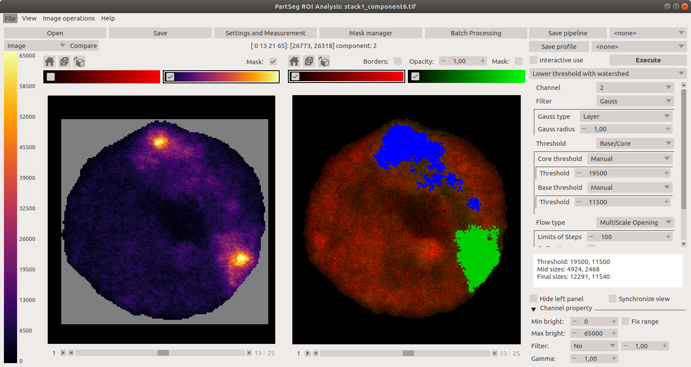
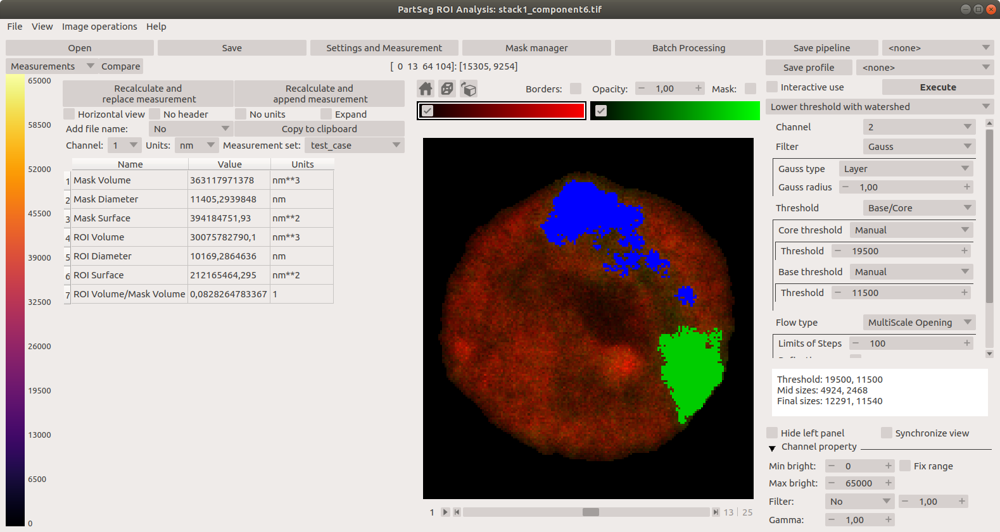
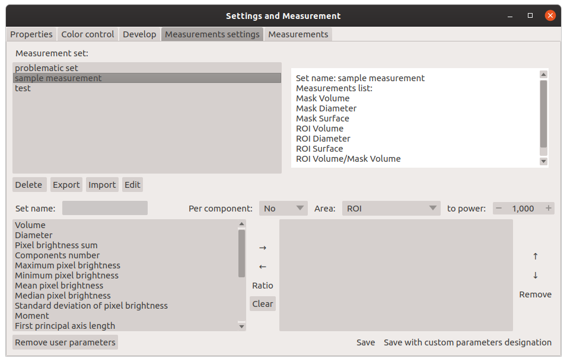
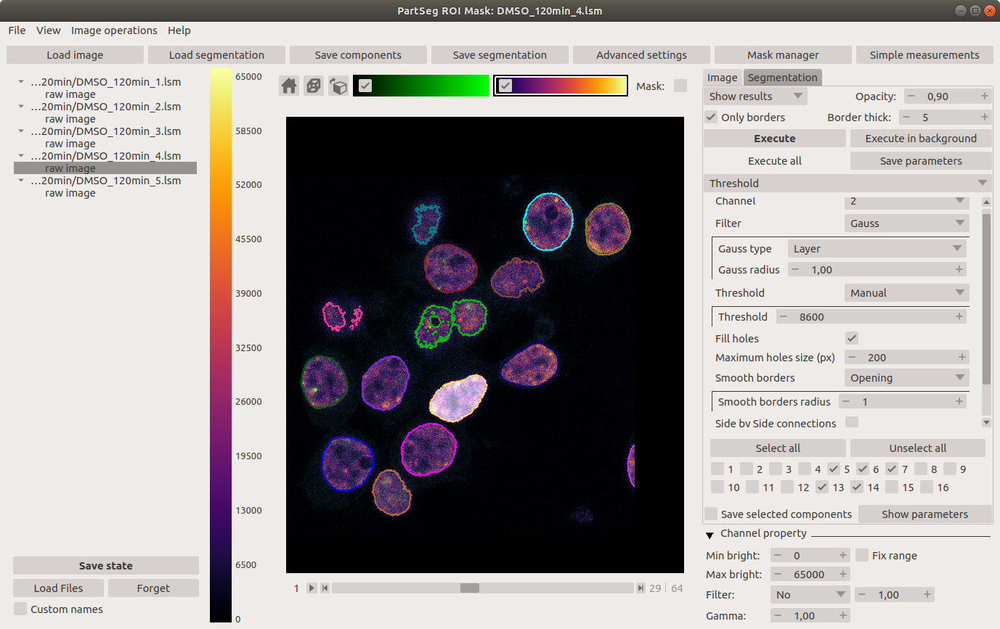

# PartSeg

PartSeg is a GUI and a library for segmentation algorithms. PartSeg also provide napari plugins for IO and labels measurement.

This application is designed to help biologist with segmentation based on threshold and connected components.

## Tutorials

-   Tutorial: **Chromosome 1 (as gui)** [link](https://github.com/4DNucleome/PartSeg/blob/master/tutorials/tutorial-chromosome-1/tutorial-chromosome1_16.md)
-   Data for chromosome 1 tutorial [link](https://4dnucleome.cent.uw.edu.pl/PartSeg/Downloads/PartSeg_samples.zip)
-   Tutorial: **Different neuron types (as library)** [link](https://github.com/4DNucleome/PartSeg/blob/master/tutorials/tutorial_neuron_types/Neuron_types_example.ipynb)

## Installation

-   From binaries:
    -   [Windows](https://4dnucleome.cent.uw.edu.pl/PartSeg/Downloads/PartSeg-lastest-windows.zip) (build on Windows 10)
    -   [Linux](https://4dnucleome.cent.uw.edu.pl/PartSeg/Downloads/PartSeg-lastest-linux.zip) (build on Ubuntu 18.04)
    -   [MacOS](https://4dnucleome.cent.uw.edu.pl/PartSeg/Downloads/PartSeg-lastest-macos.zip) (build on MacOS Mojave)

-   With pip:
    -   From pypi: `pip install PartSeg[all]`
    -   From repository: `pip install git+https://github.com/4DNucleome/PartSeg.git`

Installation troubleshooting information could be found in wiki: [wiki](https://github.com/4DNucleome/PartSeg/wiki/Instalation-troubleshoot).
If this information does not solve problem you can open [issue](https://github.com/4DNucleome/PartSeg/issues).

## Running

If you downloaded binaries, run the `PartSeg` (or `PartSeg.exe` for Windows) file inside the `PartSeg` folder

If you installed from repository or from pip, you can run it with `PartSeg` command or `python -m PartSeg`.
First option does not work on Windows.

PartSeg export few commandline options:

-   `--no_report` - disable error reporting
-   `--no_dialog` - disable error reporting and error dialog. Use only when running from terminal.
-   `segmentation_analysis` - skip launcher and start analysis gui
-   `segmentation` - skip launcher and start segmentation gui

## napari plugin

PartSeg provides napari plugins for io to allow reading projects format in napari viewer.

## Save Format

Saved projects are tar files compressed with gzip or bz2.

Metadata is saved in data.json file (in json format).
Images/masks are saved as *.npy (numpy array format).

## Interface

Launcher. Choose the program that you will launch:

Main window of Segmentation Analysis:

Main window of Segmentation Analysis with view on measurement result:

Window for creating a set of measurements:

Main window of Mask Segmentation:

## Laboratory

Laboratory of Functional and Structural Genomics
[http://4dnucleome.cent.uw.edu.pl/](http://4dnucleome.cent.uw.edu.pl/)

## Cite as

Bokota, G., Sroka, J., Basu, S. et al. PartSeg: a tool for quantitative feature extraction
from 3D microscopy images for dummies. BMC Bioinformatics 22, 72 (2021).
[https://doi.org/10.1186/s12859-021-03984-1](https://doi.org/10.1186/s12859-021-03984-1)
