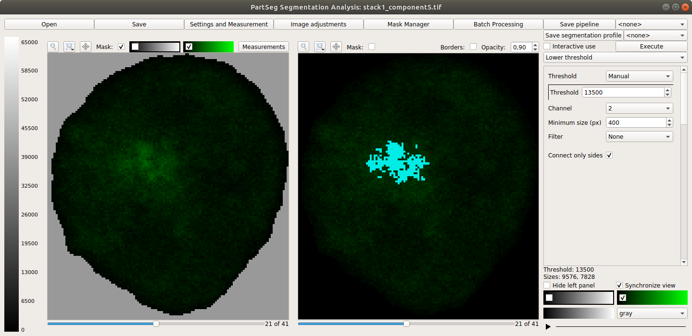
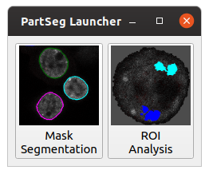
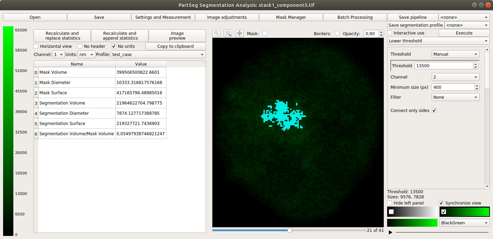
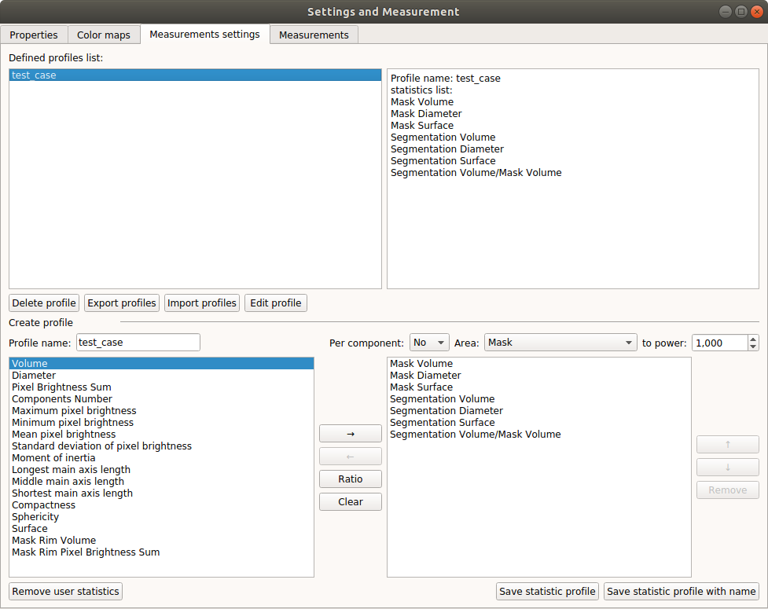
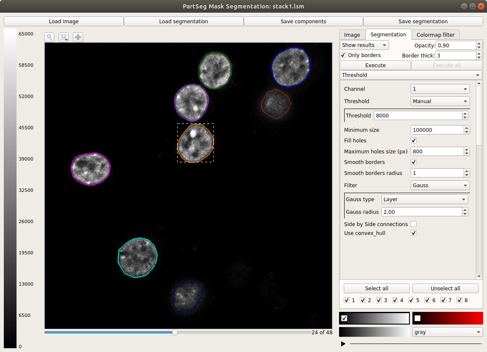

# PartSeg
 

PartSeg is gui and library for segmentation algorithms.

This application is designed to help biologist with segmentation 
based on threshold and connected components 

## Tutorials
* Tutorial: **Chromosome 1 (as gui)** [link](https://4dnucleome.cent.uw.edu.pl/PartSeg/tutorials/tutorial_chromosome_1/)
* Data for chromosome 1 tutorial [link](https://4dnucleome.cent.uw.edu.pl/PartSeg/Downloads/PartSeg_samples.zip)
* Tutorial: **Different neuron types (as library)** [link](https://4dnucleome.cent.uw.edu.pl/PartSeg/tutorials/tutorial_diferrent_neurons/)

## Installing
* From binaries:
  * [Windows](https://4dnucleome.cent.uw.edu.pl/PartSeg/Downloads/PartSeg-lastest-windows.zip) (build on Windows 10)
  * [Linux](https://4dnucleome.cent.uw.edu.pl/PartSeg/Downloads/PartSeg-lastest-linux.zip) (build on Ubuntu 18.04)
  * [MacOS](https://4dnucleome.cent.uw.edu.pl/PartSeg/Downloads/PartSeg-lastest-macos.zip) (build on MacOS Mojave) 
* With pip (on linux you need to install `numpy` and `cython` earlier) 
    * From pypi: `pip install PartSeg`
    * From repository: `pip install git+https://github.com/4DNucleome/PartSeg.git`
  

## Running 
If you download binaries look for `PartSeg_exec` file inside the `PartSeg` folder 

If you install from repository or from pip you cat run it with `PartSeg` command or `python -m PartSeg`. 
First option do not work on Windows. 

PartSeg export few commandline options: 
- `--no_report` - disable reporting errors to authors
- `--no_dialog` - disable reporting errors to authors and showing error dialog. Use only when running from terminal.
- `segmentation_analysis` - skip launcher and start analysis gui
- `segmentation` - skip launcher and start segmentation gui 

## Additional remarks:
Current version of PartSeg use `tifffile` package to read `*.tiff` files. Because newer version is easy to install
only on Windows. If you install it manually with imagecodecs it should work.    

## Save Format
Saved project are tar files compressed with gzip or bz2 

Metadata are saved in data.json file (in json format)
images/mask are saved as *.npy (numpy array format)

## Interface
Launcher. Chose program that you will launch:     
  
Main window of Segmentation Analysis:  
  
Main window of Segmentation Analysis with view on measurement result:  
  
Window for creating set of measurements:   
  
Main window of Mask Segmentation:  
  

## Laboratory
Laboratory of functional and structural genomics
http://4dnucleome.cent.uw.edu.pl/

