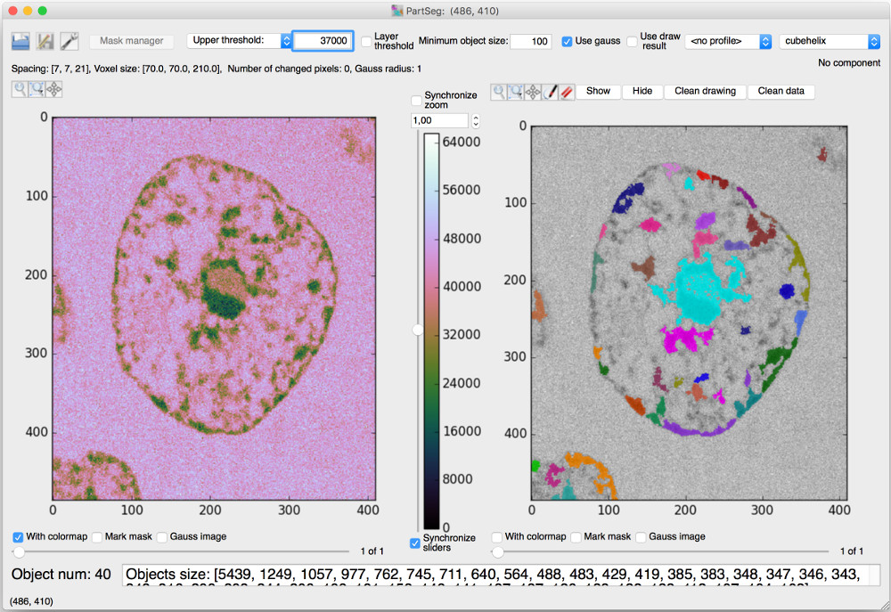
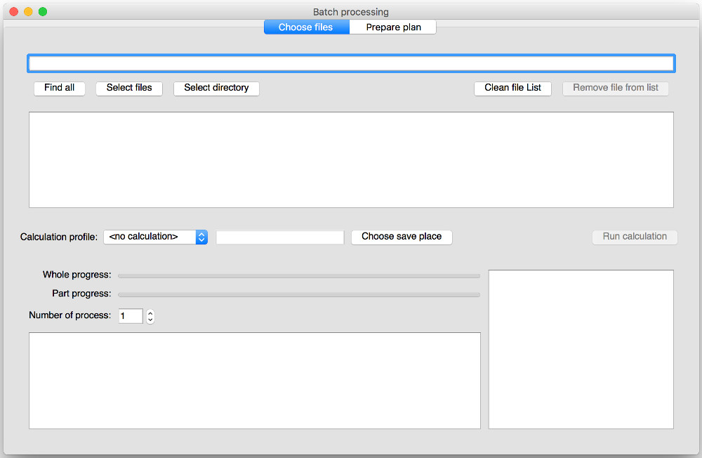
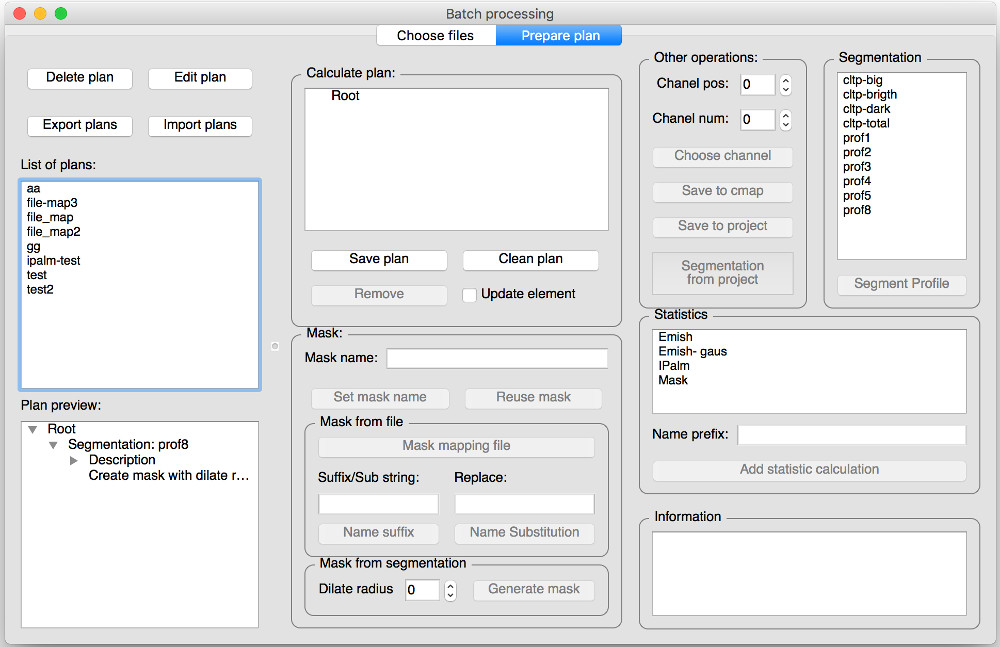
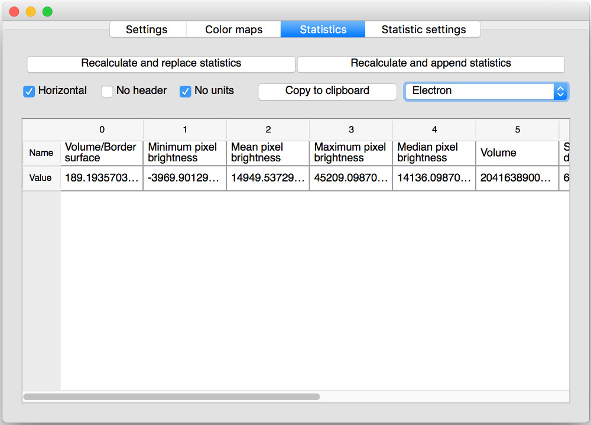

# PartSeg - gui for segmentation algorithms

This application is designed to help biologist with segmentation 
based on threshold and connected components 

## Run from code
* PartSeg - `python src/partseg_main.py`
* StackSeg - `python src/stackseg_main.py`

## Non standard python libraries dependencies
* tifffile
* SimpleITK
* Matplotlib
* Numpy
* PyQt in version 4 or 5
* appdirs
* h5py

## Project Web Page
http://nucleus3d.cent.uw.edu.pl/PartSeg  (binaries here)

## Save Format
Saved project are tar files compressed with gzip or bz2 

Metadata are saved in data.json file (in json format)
images/mask are saved as *.npy (numpy array format)

## Interface

## Laboratory
Laboratory of functional and structural genomics
http://nucleus3d.cent.uw.edu.pl/

