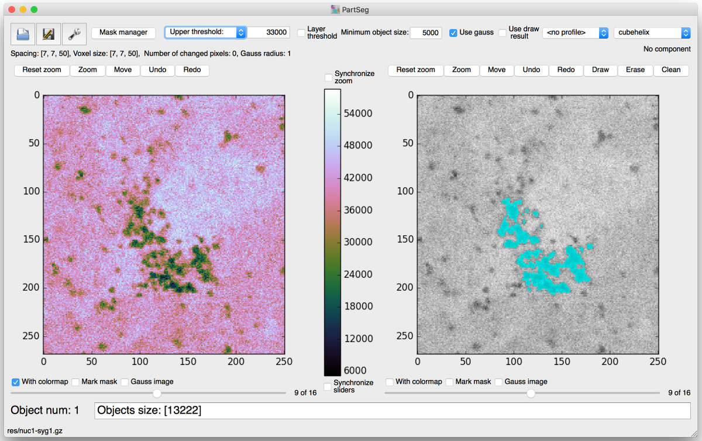

# PartSeg - gui for segmentation algorithms

This application is designed to help biologist with segmentation 
based on threshold and connected components 

## Non standard python libraries dependencies
* tifffile
* SimpleITK
* Matplotlib
* Numpy
* PyQt in version 4 or 5
* appdirs
* h5py

## Save Format
Saved project are tar files compressed with gzip  

## Interface

## Laboratory
Laboratory of functional and structural genomics
http://nucleus3d.cent.uw.edu.pl/