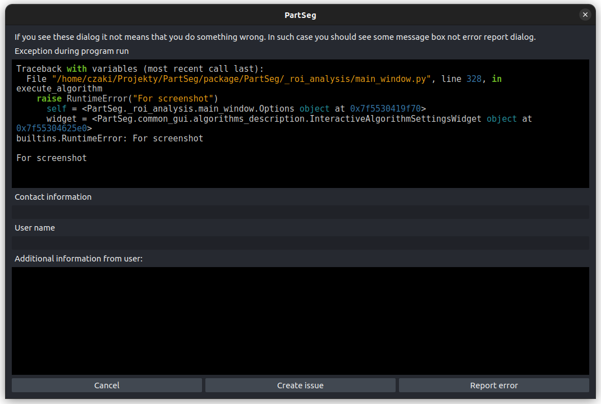

Error reporting
===============

.. important::
   In ideal state, during using PartSeg, there should be no exceptions.
   Only dialogs with information what user done wrong and how to fix it.
   So If you meet the exception please report it to the developers.

The PartSeg software is created to simplify sharing segmentation algorithms,
also with non programming persons. Because of this, next to the standard way
of error reporting using `GitHub issues <https://github.com/4DNucleome/PartSeg/issues>`_
it is possible to report error using **Send information** button in error dialog.

It is possible to disable error reporting using sentry in two way.
The first is to launch PartSeg using ``--no_report`` flag. The second is to set
``PARTSEG_SENTRY_URL`` environment variable to empty string.
This second way allow also to overwrite sentry url and collect error reports
in custom sentry instance.

Information stored in error report
----------------------------------
Error report contains information about:

* PartSeg version
* Python version
* Operating system
* List of installed packages
* Stacktrace with variables values (with full path to files)
* Computer name
* User name

The decision to collect this information was made base on collaboration with non coding users.
Information about computer name and user name are collected to find proper error report when got email from such user
or reach user to collect additional information required to solve problem.

If you prefer to not share this information, you could still open github issue
and provide information about your problem.

Control of error reporting from code
------------------------------------

It is possible to control error reporting using variables from :py:mod:`PartSeg.state_store`.
PartSeg is using :py:func:`PartSeg.common_backend.except_hook.my_excepthook` as exception hook.
