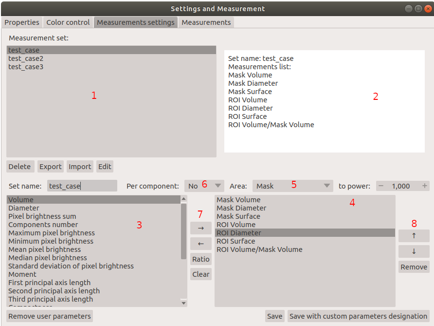
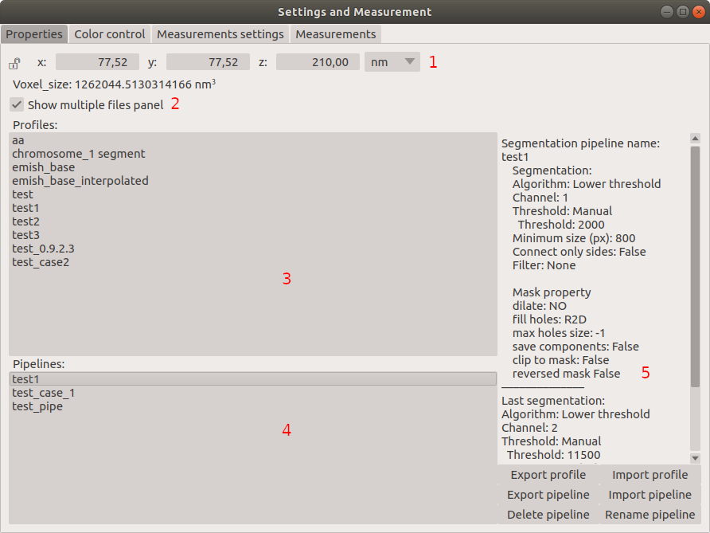
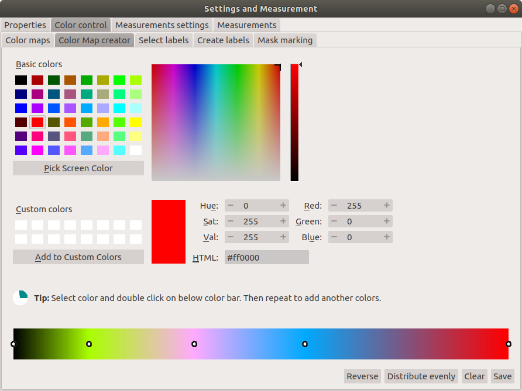
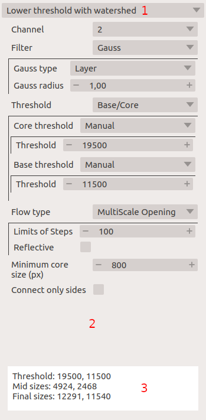
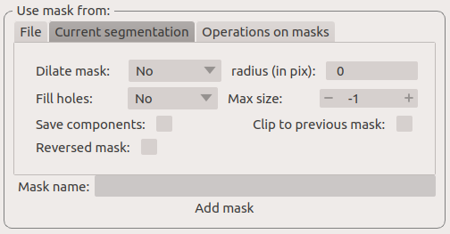

=======================================
Graphical User Interface (GUI) overview
=======================================

:Author: Grzegorz Bokota
:Version: $Revision: 1 $
:Copyright: This document has been placed in the public domain.

.. contents:: Table of Contents

In this document user interface of PartSeg is described.
As some elements are used in both modules ``Roi Analysis`` and
``Mask Segmentation`` they are described in `Common elements`_.

.. image:: images/launcher.png
   :alt: Selection of program to be launched.

Mask Segmentation GUI
---------------------

On top of the window there are 6 buttons:

*  **Load image** - loads image or image with existing segmentation.
*  **Load segmentation** - loads segmentation to already loaded image or loads
   segmentation parameters from segmentation file.
*  **Save components** - saves each of selected components to separate ``tiff`` file.
   For each component mask file is created.
*  **Save segmentation** - saves current segmentation to a file.
   File contains segmentation, its parameters and path to
   original picture on which segmentation was performed.
   Path can be absolute (may not work on another computer) or
   relative (may not work when saved file has ben moved).
*  **Advanced settings** - currently only color map and labeling administration.
*  **Mask manager** - mask part of image base on segmentation
*  **Simple measurements** - subset of measurements available in `Measurements`_ to be calculated ROI objects

1.  `Multiple files panel`_ is used to manage multiple files.
    This panel is visible by default and can be can be hidden in `image tab`_.
2.  Colorbar - Shows relation of currently used color map and
    brightness values for selected channel.
    Selection of colormap is described in `Image View`_.
3.  `Image View`_. Shows preview of current file and its segmentation result.
4.  `Segmentation parameters`_. This panel is used to set parameters of
    segmentation.

    .. image::  images/mask_control_view.png
       :alt: Part above algorithm parameters.

5.  Selects how results of segmentation are presented:

    * **Don`t show** - shows input data.
    * **Show result** - shows result of segmentation.
    * **Show selected** - shows only components selected
      at the bottom of segmentation panel (see point 15)

6.  Segmentation marker opacity.
7.  Controls display of segmentation result.
    Shows only borders or whole area of segmentation components.
8.  Controls thickness of displayed segmentation borders for components.
    Used only if 7 is selected.
9.  Executes segmentation with selected parameters.
10. Executes segmentation in background.
    Set segmentations are executed one by one in background.
    End results are available in
    `Multiple files panel`_ as ``state`` entry.
11. Executes segmentation with set parameters in batch mode.
    Execution will be done on
    files selected in `image tab`_.
    Results will be saved on disc as ``seg`` files.
12. Saves currently selected parameters as json file.
    This file can be imported using **Load Segmentation**
    with **Files of type** ``Segmentation parameters``

    .. image::  images/mask_select_component.png
       :alt: Selection which components are selected properly.

13. Selects all checkboxes.
14. Removes selection from all checkboxes.
15. Selection of single components. Selection/deselection can be done by
    clicking on a component in `Image view`_.
    Pointing on a checkbox of a component with cursor distinguishes
    given component by dashed frame in `Image view`_.
    Only selected components are saved using **Save components**.
    Selected components are omitted when next round of segmentation
    is performed.
16. Select if preserve selected components when loading different segmentation
    (from file or `Multiple files panel`_). TODO
17. Opens window with a preview of segmentation parameters for each component.
    **Reuse parameters** button from this window restores selected parameters.

.. image:: images/mask_segmentation_parameters_preview.png
   :alt: Window to preview parameters of segmentation.

Here there is description of image tab:

.. _image tab:

.. image::  images/mask_window_image.png
   :alt: View on image tab.

1. Gives information on image. Spacing parameters can be changed manually.
2. In this panel files for batch processing can be selected.
   (For further details see `select multiple files`_ part of
   `Batch processing`_ from `ROI Analysis GUI`_.)
3. Controls appearance of `Multiple files panel`_ in main window.

ROI Analysis GUI
----------------

On top of the window they are 5 buttons:

*   **Open** - loads data.
*   **Save** - saves data.
*   **Settings and Measurement** - opens window with:
    Properties_, `Color control`_ and `Measurement`_.
*   **Mask manager** - Opens `Mask manager`_ to create
    mask from current segmentation.
*   **Batch processing** - Opens `Batch processing`_ window

1.  `Multiple files panel`_ is used to manage multiple files.
    This panel is hidden by default and can be can be enabled in
    Settings and Measurements window.
    (described in `Profile, Pipeline, Project`_)
2.  Colorbar - Shows relation of currently used color map and brightness
    values for selected channel. Selection of colormap
    is described in `Image View`_.
3.  Two copies of `Image View`_. Main panel is placed on the right.
    Left panel can be used to preview raw data, selected segmentation,
    or be replaced with `Measurements`_ panel.
4.  `Segmentation parameters`_ - This panel is used to set parameters of segmentation

    Above colorbar there are two controls:

    .. image::  images/main_window_cmp.png
       :alt: Main Roi Analysis GUI

5. Controls if the left panel contains `Image view`_ or `Measurements`_.
6. Enables/disables comparison mode. Visible only when image is selected with control 5.

   * **Compare** - Copies current segmentation.
     Allows to compare segmentations made with different parameters.
   * **Remove** - Removes segmentation from left panel.

    .. image::  images/main_window_exec.png
       :alt: Main Roi Analysis GUI

7.  Saves current pipeline, which is a sequence of segmentation and masking operations.
    Name of pipeline is set in the dialog window.
8.  Selects which pipeline is applied to data.
9.  Saves current algorithm and its parameters as a profile.
    Name of profile is set in the dialog window.
10. Selects which profile is applied to the current state.
11. Enables interactive mode where segmentation is recalculated after every parameters changes.
12. Executes segmentation algorithm with current parameters.

Below `Segmentation parameters`_ there are two checkbox:

*   **Hide left panel** - Hides left panel. Useful for tight screen.
*   **Synchronize view** - Enables synchronization of both `Image view`_ panels:
    Zoom, layer, and X,Y position.

Measurement
~~~~~~~~~~~
Important part of analysis data is define what should be measured
and perform this calculation. Both utilities are available
in "Settings and Measurement" window.
TODO

Measurements settings
^^^^^^^^^^^^^^^^^^^^^

The upper part of this window is designed to manage existing sets of measurements.

1. List of already defined measurement sets.
2. Preview of selected measurement set.

    Below the list there are four buttons, which are used to
    delete, export, import and edit saved sets of measurement.

3. List of measurements currently available in PartSeg.
4. Elements selected for new measurement set.
5. Selects area on which measurement element is calculated:

   * **Mask** - area of mask.
   * **ROI** - area of ROI.
   * **Mask without ROI** - area of mask minus area of ROI.

6. Selects how measurement element handles area components. Calculate:

   * **No** - for whole area.
   * **Yes** - for each component of area.
   * **Mean** - for each component of area and then mean value of its.

7. Adding elements to selected

   *  **→** - Move element to right list.
   *  **←** - Move element to left list. May be useful to create complex one.
   *  **Ratio** - Allow to create ratio of two measurements result.
      First select numerator then click **Ratio** then select denominator
      and press **Ratio** again.
   *  **Clear** - clear chosen element

8. Control single elements of set:

   * **↑** - Move selected element up.
   * **↓** - Move selected element down.
   * **Remove** - Remove selected element.

Measurements
^^^^^^^^^^^^

This widget ia also available as left panel of main window.

1. Area to show result.
2. Select which measurement set need to be calculated.
3. Remove existing result and show result of new calculation.
4. Add result of new calculation to existing ones.

Other controls:

*  **Horizontal view** - if result should be presented in rows or columns.
*  **No header** - remove column "Name".
*  **No units** - do not show units.
*  **Expand** - if result of per component calculations should.
   be show in separate columns or as inline list ``[res1, res2, ...]``.
*  **Add file name** - select if add element with file name:

   - **No** - do not add.
   - **Short** - add only only file name.
   - **Full** - add full path to file.

*  **Channel** - on which channel calculation should be performed.
*  **Units** - in which units show physical values.

Profile, Pipeline, Project
~~~~~~~~~~~~~~~~~~~~~~~~~~

In PartSeg there are defined three ways for saving segmentation.
The first two are:

*  **Profile** - It is saved parameters of one algorithm.
*  **Pipeline** - It is saved minimal sequence of segmentation
   and mask operation.

Both operation are saved in application but can be managed in
**Properties** tab of **Settings and Measurement** which is describe bellow.

Third option is to save current work as project. Project contains:

*  Raw data image
*  Mask image if present
*  Whole pipeline needed to create current segmentation.
*  All masks and segmentation created in middle steps.

Properties
^^^^^^^^^^

1.  Image spacing with units.
2.  If show Multiple files panel in main window.
3.  List of segmentation profiles.
4.  List of segmentation pipelines.
5.  Preview of selected Profile/pipeline.

Additionally, bellow preview there are 6 buttons.
We think that they are self explanatory with addition that,
when profile is selected two bottom ones are "Delete profile"
and "Rename profile".

Batch processing
~~~~~~~~~~~~~~~~

Prepare batch plan
^^^^^^^^^^^^^^^^^^

.. image::  images/batch_create_plan.png
   :alt: View on Properties Tab in Settings and Measurement.

1. List of already defined bath plan.
   Above buttons allow to manage them.
2. Preview of currently selected plan from saved one.
3. Preview on current edited plan.
4. Add saving operation to plan and selection of root type:

   * **Image** - only image is loaded. As input file can be used any of:

     + image,
     + ROI project,
     + mask project.

     (each component is loaded as separated entry),
   * **Project** - load whole ROI project as it is.
   * **Mask project** - load image with mask. Possible entry:

     + ROI project,
     + mask project.

5. Selection of segmentation profile or pipeline to be add to plan.
6. Selection of measurement set to be add to plan.
7. Preview of already selected pipeline/profile/measurement.
8. Mask creation widget. Mask can hev set name for past reference.
   It has 3 states:

   * Load mask from file:

     |batch_mask_from_file|

     + **Suffix** - add suffix to create file name.
     + **Replace** - use substitution in file name to create mask name.

   * Create mask from segmentation. This is described
     in `Mask manager`_ in `Common elements`_.

     |batch_mask_from_segmentation|

   * Create mask from other masks:

     |batch_mask_from_masks|

     + **Mask sum**
     + **Mask intersection**

Execute batch
^^^^^^^^^^^^^

.. _select multiple files:

1. Text field with pattern to find files to proceed.
   Pattern matching is in UNIX style.
   More details in https://docs.python.org/3/library/glob.html.
2. Buttons:

   *  **Select files** - select given files.
   *  **Select directory** - use dialog to find base
      directory for pattern search.
      Path to selected directory will be put in 1.
   *  **Find all** - find all files witch match to pattern from 1.
      It show dialog with list of found file for verification:

      |batch_find_files|

   *  **Remove all** - clean file list,
   *  **Remove file** - remove selected one.

3. List of already selected files.

    .. image::  images/batch_execute.png
       :alt: View on Properties Tab in Settings and Measurement.

4.  Select batch plan.
5.  Path to file with saved measurement.
    Use **Save result as** to modify.
6.  Global progress bar. Summ of all tasks.
7.  Progress bar for current task.
8.  Number of workers to be used during batch.
    Can be adjusted during runtime.
9.  Error log. For report double click on entry.
10. Information about tasks status.
11. Launch batch calculation. Before it runs
    window described bellow for check if everything is set correctly.

    .. image::  images/batch_check_ok.png
       :alt: View on Properties Tab in Settings and Measurement.

    1. Default voxel size for images which has no such information in metadata.
       Initial value is from current file from main GUI.
    2. Set prefixes for processing data:

       * Prefix for calculation relative path of processed images
       * Prefix for save elements. Save path is ``save_prefix + relative_path``

    3. Settings for measurement save location and sheet
    4. Information if PartSeg can find all needed data for each entry.
       Bellow image show view on version with errors.

   .. image::  images/batch_check_bad.png
      :alt: View on Properties Tab in Settings and Measurement.

Common elements
---------------
In this section there are described elements which are
common for "ROI Analysis GUI" and "Mask Segmentation GUI".

Image view
~~~~~~~~~~

Zoom of image can be also changed by Ctrl+Mouse scroll.

1.  Reset Zoom.
2.  Change to 3D rendering.
3.  Channel view control. Only Channels with selected checkbox
    are visible. `Color map`_ for current channel
    can be selected when click in triangle in upper right corner
    |channel_select|. This triangle is visible when mouse is over widget.
4.  Mark segmentation only by borders or by masking whole area.
5.  Set opacity of segmentation marking.
6.  Mark mask visible.
7.  Control which layer is visible.
    If image contains time data, then similar
    slider will be visible on left part of image.

In `Mask Segmentation GUI`_ elements 5 and 6 are place above
Algorithm Parameters part.

.. image::  images/range_control.png
   :alt: Image view widget.

1.  Set boundaries for minimum maximum brightness for given channel.
2.  Use boundaries for presenting current channel.
    If is checked then lock is present right to checkbox |fixed_range|.
3.  Use filter (Median or gauss) for presenting current channel.
    If different to *No* then proper symbol is present right to checkbox |filter|.
4. Translate brightness with gamma. If different than 1 then proper symbol is present right to checkbox |gamma|.

Color control
~~~~~~~~~~~~~

PartSeg give user option to use custom colormap
to adjust parameters of intensity presentation.
For multichannel image PartSeg use maximum projection
to calculate final view.

Also segmentation labels can be adjusted.
If more labels is need than is defined then
they are defined in cyclic way.

Here we describe widget used for control this elements.

Color maps
^^^^^^^^^^
.. _Color map:

.. image:: images/colormap_list.png
   :alt: View on list of color maps

*  Only color maps with checked checkbox are available to select in
   `Image View`_ controls aaa
*  Only custom created color maps can be deleted with a |delete| button.
*  Some of existing color maps (all custom) can be used as a base to
   creation of a new color map using |edit| button.

Color Map creator
^^^^^^^^^^^^^^^^^

After selection of a new color, double click on the bottom bar to create position marker.

Markers can be moved by drag and drop or removed by double click.
Colors between markers are created with linear interpolation.

Select labels
^^^^^^^^^^^^^

In this tab User can select coloring scheme of segmentation components labels .

*  Current scheme is choosen with radio button (|radio_button|) on the left.
*  Custom schemes can be deleted with |delete| button.
*  New scheme can be defined based on old one using |edit| button.

Create labels
^^^^^^^^^^^^^
.. image:: images/create_labels.png
   :alt: View on labels map creator widget.

After selection of a new color use **Add color** button.
Color order can be changed by drag and drop.

Mask marking
^^^^^^^^^^^^

After selection of color use **Change mask color** button to confirm.
Mask marker opacity can be changed with a spin box in lower right corner.

Segmentation parameters
~~~~~~~~~~~~~~~~~~~~~~~
In this widget User can choose segmentation parameters.

1. Drop down list on which user can select segmentation method.
2. Parameters settings.
3. Additional information produced by algorithm (e.g. information on used threshold, components sizes etc.).

Mask manager
~~~~~~~~~~~~
This widget/dialog allows to set parameters of transferring
of current segmentation into a new mask.

.. image:: images/mask_manager.png
   :alt: Mask Manager

1. Select to use dilation (2d or 3d) with set
   radius in pixels. If dilation is in 3d then radius in z plane is calculated
   base on image spacing. Negative values of radius will reduce mask size.
2. Select to fill up holes in a current segmentation. Holes are parts of background, which
   are not connected (in 2d or 3d - depends on selection) to a border of image.
   If Maximum size is set to -1 then all holes will be closed.
3. **Save components** allows to create a new mask made of multiple components present in current segmentation.
   **Clip to previous mask** option is useful when using positive radius in Dilate mask
   and want to fit it in previously defined mask.
4. Creates mask based on negative of current selection (disables **Save comnponents** option).
5. Shows calculated dilation radius in x, y, z for current image.
6. Undo of last masking operation.
7. Creates new mask or draws back to previously undone one.
8. TODO
9. TODO

Multiple files panel
~~~~~~~~~~~~~~~~~~~~~
This widget enables to work on multiple files without need
to reload them from disc.

Each file is presented in the list as a raw image and multiple states created by user.
Each state represents segmentation done with different parameters.

.. image:: images/multiple_files_widget.png
   :alt: Multiple files panel

1.  List of opened files and created states.
2.  Saves current image state. Each stated can be reloaded by double click.
3.  Removes saved state.
4.  Loads multiple files to PartSeg.
5.  Enables to set custome names for saved states.

Tips and Tricks
---------------

In order to run selected module without PartSeg Launcher
create PartSeg_exec shortcut, next open its Properties and add proper
argument at the end of access path.
For ROI Analysis add ``roi_analysis`` and for
Mask Segmentation add ``mask_segmentation``.
See image below showing shortcut Properties for ROI Analysis.

.. image:: images/shortcut.png
   :alt: Example of shortcut to specified subprogram

.. |edit| image:: images/edit.png
.. |radio_button| image:: images/radio_button.png
.. |channel_select| image:: images/channel_select.png
.. |fixed_range| image:: images/fixed_range.png

.. |gamma| image:: images/gamma.png
.. |batch_mask_from_file| image::  images/batch_mask_from_file.png
   :alt: Load mask from file.

.. |batch_find_files| image:: images/batch_find_files.png
