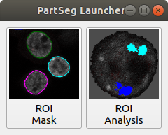
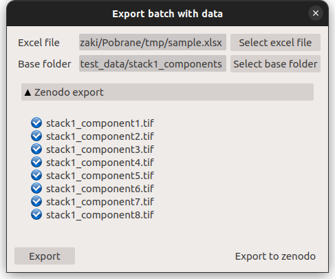
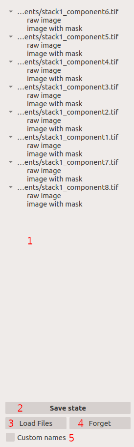
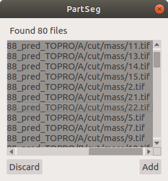

=======================================
Graphical User Interface (GUI) overview
=======================================

:Author: Grzegorz Bokota
:Version: $Revision: 1 $
:Copyright: This document has been placed in the public domain.

.. contents:: Table of Contents

In this document user interface of PartSeg is described.
As some elements are used in both modules ``Roi Analysis`` and
``ROI Mask`` they are described in `Common elements`_.

ROI Mask GUI
------------

.. image::  images/mask_window.png
   :alt: ROI Mask GUI

On top of the window there are 6 buttons:

*  **Load image** - loads image or image with existing segmentation.
*  **Load segmentation** - loads segmentation to the already loaded image or loads
   segmentation parameters from the segmentation file.
*  **Save components** - saves each of the selected components to a separate ``tiff`` file.
   For each component, a mask file is created.
*  **Save segmentation** - saves current segmentation to a file.
   The file contains segmentation, its parameters, and the path to
   the original picture on which segmentation was performed.
   The path can be absolute (may not work on another computer) or
   relative (may not work when the saved file has been moved).
*  **Advanced settings** - currently contains only colormap and labeling administration.
*  **Mask manager** - Allows to add new mask based on the current segmentation. New mask can be adjusted by dilation, filling of holes existing in current segmentation or by reverisng segmented area.
*  **Simple measurements** - a subset of selected, basic measurements for quick analysis. The full list is available in `Measurements`_ in ROI analysis

1.  `Multiple files panel`_ anables managing multiple files. Each loaded image is shown as raw image, and can be saved after each segmentation as a separate state. It allows for comparison of segmentations performed with different parameters. This panel is visible by default, but can be hidden in the `image tab`_.
2.  Colorbar - Shows relation of the currently used color map and brightness values for the selected channel.
    The selection of colormap is described in the `Image View`_.
3.  `Image View`_. Shows a preview of the current file and its segmentation result.
4.  `Segmentation parameters`_. This panel serves for setting the parameters of
    segmentation.

    .. image::  images/mask_control_view.png
       :alt: Part above algorithm parameters.

5.  Selects how results of segmentation are presented:

    * **Don`t show** - shows input data.
    * **Show result** - shows the result of segmentation.
    * **Show selected** - shows only components selected
      at the bottom of the segmentation panel (see point 15)

6.  Segmentation marker opacity setting.
7.  Controls display of the segmentation result.
    Shows only borders or the whole area of segmentation components.
8.  Controls the thickness of displayed segmentation borders.
    Used only if 7 is selected.
9.  Executes segmentation with selected parameters.
10. Executes segmentation in the background.
    Set segmentations are executed one by one in the background.
    End results are available in
    `Multiple files panel`_ as ``state`` entry.
11. Executes segmentation with set parameters in batch mode.
    Execution will be done on
    files selected in the `image tab`_.
    Results will be saved on a disc as ``seg`` files.
12. Saves currently selected parameters as a json file.
    This file can be imported using **Load Segmentation**
    with **Files of type** ``Segmentation parameters``

    .. image::  images/mask_select_component.png
       :alt: Selection which components are selected properly.

13. Selects all checkboxes.
14. Removes selection from all checkboxes.
15. Selection of a single component. Selection/deselection of components can be done by clicking on a component in `Image view`_.
    or enebling apopriate checkbox. Pointing checkbox with a coursor highlits selected component in `Image view`_.
    Only components selected in checkboxes are saved using **Save components** tab.
    Components wich are selected are omitted, when the next round of segmentation is performed.

16. When selected allows for comaprison of segmentations made with different parameters. To do so enable **Save selected components** checkbox, than perform segmentation and select chosen components. Next save segmentation by **Save Segmenation**. Use **Unselect all** and perform another segmentation with a diffeternt parameters. Select chosen components and load previously done segmentation using **Load Segmentation**. Now selected components from both segmentations are displayed in the `Image view`_ and each is represented as a separate checkbox. The same can be done using `Multiple files panel`_ and saving each segmentation as a separate state using **Save state** tab.

17. Opens the window with a preview of segmentation parameters for each component.
    **Reuse parameters** button from this window restores selected parameters.

Tab providing description of image:

.. _image tab:

1. Gives information on the image. The upper panel shows image path, and the lower panel gives spacing parameters, which can be changed manually.
2. In this panel files for batch processing can be selected.
   (For further details see `select multiple files`_ part of
   `Batch processing`_ from `ROI Analysis GUI`_.)
3. Controls the emergence of `Multiple files panel`_ in the main window.

ROI Analysis GUI
----------------

.. image::  images/main_window.png
   :alt: Main Roi Analysis GUI

Bottons visible in the top row of the main window:

*   **Open** - loads data.
*   **Save** - saves data.
*   **Settings and Measurement** - opens a window containing:
    Properties_, `Color control`_, and `Measurements`_.
*   **Mask manager** - Opens `Mask manager`_ to create
    mask from current segmentation.
*   **Batch processing** - Opens `Batch processing`_ window

1.  `Multiple files panel`_ is used to manage multiple files.
    This panel is hidden by default and can be enabled in
    Settings and Measurements window.
    (described in `Profile, Pipeline, Project`_)
2.  Colorbar - Shows currently used color map with brightness values for the selected channel. The selection of colormap is described in `Image View`_.
3.  Two copies of `Image View`_. The main panel is placed on the right.
    The left panel can be used to preview raw data, selected segmentation,
    or be replaced with `Measurements`_ panel using controls placed above it:
4.  `Segmentation parameters`_ - This panel is used to set parameters of segmentation

5. Controls if the left panel contains `Image view`_ or `Measurements`_.
6. Enables/disables comparison mode. Visible only when the image is selected with control 5.

   * **Compare** - Copies current segmentation.
     Allows comparing segmentations made with different parameters.
   * **Remove** - Removes segmentation from left panel.

    .. image:: images/main_window_exec.png
       :alt: Main Roi Analysis GUI

    Settings of segmentation parameters are available on the right side of the main "ROI Analysis" window

7.  Saves the current pipeline, which is a sequence of segmentation and masking operations.
    The name of the pipeline can be set in the dialog window.
8.  Selects which pipeline is applied to data.
9.  Saves the current algorithm and its parameters as a profile.
    The name of the profile can be set in the dialog window.
10. Selects which profile is applied to the current state.
11. Enables interactive mode where segmentation is recalculated after change of any segmentation parameter.
12. Executes segmentation algorithm with current parameters.

Two checkboxes placed below the`Segmentation parameters`_ :

*   **Hide left panel** - Enables hiding of the left panel. Useful for the tight screen.
*   **Synchronize view** - Enables synchronization of Zoom, layer, and X, Y position for both `Image view`_ panels

Profile, Pipeline, Project
~~~~~~~~~~~~~~~~~~~~~~~~~~

In PartSeg there are three defined ways of saving segmentation.
The first two options save only segmentation parameters:

*  **Profile** - saves parameters set for segmentation algorithm.
*  **Pipeline** - saves sequence of segmentation, mask created based on this segmentation with help of **Mask manager** and next round of segmentation, which is made within masked area. This steps can be repeated several times to create pipiline, which can be later used in batch processing.

The list of profiles and pipelines and their properties is avaliable in
**Properties** tab of **Settings and Measurement**.

The third option is to save the current work as a project. Project will contain:

* Raw data image with a mask (if present)
* The whole profile or pipeline needed to create current segmentation.
* All masks and segmentations created in between.

Settings and Measurement
~~~~~~~~~~~~~~~~~~~~~~~~

This bottom enables popup window with 4 tabs: Properties, Color control, Measurements settings, Measurements

Properties
^^^^^^^^^^
Shows properties of the currnet image, list of profiles and pipelines and their properties.

.. image::  images/segmentation_advanced.png
   :alt: View on Properties Tab in Settings and Measurement.

1.  Image spacing with units.
2.  Enables Multiple files panel in the main "ROI Analysis" window.
3.  List of segmentation profiles.
4.  List of segmentation pipelines.
5.  Preview of properties of the selected Profile/pipeline.

Additionally, bellow the preview of propertes 6 buttons are avaliable to control export, import, deletion and renaming of pipelines and profiles.

Measurements settings
^^^^^^^^^^^^^^^^^^^^^

.. image::  images/measurement_prepare.png
   :alt: View on widget for prepare measurement set

The upper part of this window is designed to manage existing sets of measurements.

1. Contains a list of already defined measurement sets.
2. Gives a preview of properties of selected measurement set.

    Four botton placed below the list of efined measurement sets are used to
    delete, export, import, and edit of saved sets of measurement.

3. Contains a list of measurements currently available in PartSeg.
4. Contains a list of elements selected for the new measurement set.
5. Selects area on which measurement element is calculated:

   * **Mask** - the area of the mask.
   * **ROI** - the area of ROI.
   * **Mask without ROI** - the area of the mask minus the area of ROI.

6. Selects how the measurement element handles area components.

   * **No** - measurment will be made for the whole segmented area.
   * **Yes** - measurment will be made for each component separately.
   * **Mean** - measurment will be made for each component of area and then mean value will be calculated.

7. Adding selected elements to created measurement set

   *  **→** - Moves the element to the list on the right (newly created measurement set).
   *  **←** - Moves the element to the list on the left. Allows to define new element for the future use.
   *  **Ratio** - Allows to create a ratio of two measurements from the list.
      First select the numerator, next selecte **Ratio** then select the denominator and confirm with selecing **Ratio** again.
   *  **Clear** - clears chosen element from the list

8. Controls the position of the single elements on the list:

   * **↑** - Moves selected element up.
   * **↓** - Moves selected element down.
   * **Remove** - Removes selected element.

Measurements
^^^^^^^^^^^^

.. image::  images/measurement_calculate.png
   :alt: View on measurement calculation widget.

This widget can be enabled as the left panel of the main window by chosing Measurments tab placed above left window.

1. Shows numerical features calculated for the currently segmented area using selected measurment set .
2. Selects measurement set.
3. Removes result showed in 1. and replaces it with the result of the new calculation.
4. Adds the new result of the new calculation to the existing ones.

Other controls:

*  **Horizontal view** - toggles between rows or columns view.
*  **No header** - removes column "Name" from the displayed results.
*  **No units** - disables units in the displayed results.
*  **Expand** - shows the results for each component in the separate row or column
*  **Add file name** - controls how file name is displayed in the result:

   - **No** - no name will be displayed.
   - **Short** -only name file will be displayed .
   - **Full** - full path to the file will be displayed.

*  **Channel** - controls which channel is used for the calculation.
*  **Units** - controls in which units physical values are shown .

Batch processing
~~~~~~~~~~~~~~~~

Prepare batch plan
^^^^^^^^^^^^^^^^^^

1. List of already defined bath plan.
   The above buttons allow to manage them.
2. Preview of the currently selected plan from saved one.
3. Preview on the current edited plan.
4. Add saving operation to plan and selection of root type:

   * **Image** - only image is loaded. As input file can be used any of:

     + image,
     + ROI project,
     + mask project.

     (each component is loaded as a separated entry),
   * **Project** - load whole ROI project as it is.
   * **Mask project** - load image with the mask. Possible entry:

     + ROI project,
     + mask project.

5. Selection of segmentation profile or pipeline to be added to plan.
6. Selection of measurement set to be added to the plan.
7. Preview of already selected pipeline/profile/measurement.
8. Mask creation widget. Mask can have a set name for past reference.
   It has 3 states:

   * Load mask from file:

     |batch_mask_from_file|

     + **Suffix** - add suffix to create file name.
     + **Replace** - use substitution in the file name to create a mask name.

   * Create a mask from segmentation. This is described
     in `Mask manager`_ in `Common elements`_.

     |batch_mask_from_segmentation|

   * Create a mask from other masks:

     |batch_mask_from_masks|

     + **Mask sum**
     + **Mask intersection**

Execute batch
^^^^^^^^^^^^^
.. image::  images/batch_select_files.png
   :alt: Wiew on widget for select files to proceed.

.. _select multiple files:

1. Text field with a pattern to find files to proceed.
   Pattern matching is in UNIX style.
   More details on https://docs.python.org/3/library/glob.html.
2. Buttons:

   *  **Select files** - select files for analysis.
   *  **Select directory** - use dialog to find the base directory for pattern search.
      The path to the selected directory will be put in 1.
   *  **Find all** - find all files witch match to pattern from 1.
      It shows a dialog with a list of found file for verification:

      |batch_find_files|

   *  **Remove all** - cleans file list,
   *  **Remove file** - removes selected one.

3. List of already selected files.

    .. image::  images/batch_execute.png
       :alt: View on Properties Tab in Settings and Measurement.

4.  Select the batch plan.
5.  Path to a file with saved measurement.
    Use **Save result as** to modify.
6.  Global progress bar. Sum of all tasks.
7.  Progress bar for the current task.
8.  The number of workers to be used during the batch.
    Can be adjusted during runtime.
9.  Error log. For a report double click on the entry.
10. Information about task status.
11. Launches batch calculation, by opening a popout window described bellow, which allows to check if everything is set correctly.

    .. image::  images/batch_check_ok.png
       :alt: View on Properties Tab in Settings and Measurement.

    1. Default voxel size for images which have no such information in the metadata.
       The initial value is taken from the current file run the main GUI.
    2. Sets prefixes for processing data:

       * Prefix for calculation relative path of processed images
       * Prefix for saving elements. Save path is ``save_prefix + relative_path``

    3. Settings for a resulting spreadsheet localisation and name
    4. Gives information if PartSeg can find all the needed data for each entry.
       The image placed bellow image shows a View on Properties Tab in Settings and Measurement containing errors.

   .. image::  images/batch_check_bad.png
      :alt: View on Properties Tab in Settings and Measurement.

Export data and batch
^^^^^^^^^^^^^^^^^^^^^
The main output of PartSeg batch processing is excel file with output of all measurements. Next to it there is also
spreadsheet with batch plan saved. This gives the ability to automatically prepare a package that will contain
Batch plan, measurement outputs and input values. To use this please click Export batch with data in
input files tab of Batch Processing window. This will open dialog with options to select files to export.

After that select excel file with batch output and eventually correct
Base folder path (need to be set for batch output created before PartSeg 0.15.2).
If all required files are found on drive the Export button will be activated and allow to create archive containing all required files
that can be used to share results with other users or create supplementary materials for publication.

If the user wants to share the data using zenodo then he/she needs to provide authorization token. The token can be generated
in settings on `Zenodo page <https://sandbox.zenodo.org/account/settings/applications/>`_.
To enable export button, next to the token, the title, author, author affiliation, and description need to be provided.
Other authors could be provided, after creation of the record, on Zenodo page.

When export is finished the user will be informed about link to the created record.

It could be also found in upload section on zenodo page. The record will be draft and need to be published manually.

Common elements
---------------
In this section common elements for "ROI Analysis GUI" and "ROI Mask GUI" are described.

Image view
~~~~~~~~~~

The zoom of the image can be also changed by a Ctrl+Mouse scroll.

.. image::  images/image_view.png
   :alt: Image view widget.

1.  Resets Zoom.
2.  Changes view to a 3D rendering.
3.  Channel view control. Only Channels with a selected checkbox are visible. `Color map`_ for the current channel
    can be selected when clicking in the triangle in the upper right corner
    |channel_select|. This triangle is visible when the coursor is placed over the widget.
4.  Switches the view of segmenation between showing only segmentation borders or the whole segmented area.
5.  Set the opacity of segmenattion view.
6.  Marks mask visible or not.
7.  Controls which layer is visible.
    If the image contains time data, then a similar
    slider will be visible on the left part of the image.

In `ROI Mask GUI`_ elements 5 and 6 are placed above
the Algorithm Parameters part.

1.  Sets boundaries of minimum maximum brightness for the given channel.
2.  Uses boundaries for presenting the current channel.
    When checked then icon of the lock is present right next to a checkbox |fixed_range|.
3.  Enables filter (Median or gauss) for presenting the current channel.
    If different to *No* then the proper symbol is present right next to checkbox |filter|.
4. Translates brightness with gamma. If different than 1 then the proper symbol is present right next to checkbox |gamma|.

Color control
~~~~~~~~~~~~~

PartSeg give user an option to use a custom colormap
to adjust parameters of intensity presentation.
For multichannel image, PartSeg uses maximum projection
to calculate the final view.

Also, segmentation labels can be adjusted.
If more labels are needed user can define them cyclically.

Here the widgets used to control these elements are described.

Color maps
^^^^^^^^^^
.. _Color map:

*  Color maps are available for channels with a checked checkbox and can be selected in the
   `Image View`_ controls aaa
*  Only custom created color maps can be deleted with a |delete| button.
*  Some of the existing color maps and all custom created masps can be used as a base for
   creation of a new color map using the |edit| button.

Color Map creator
^^^^^^^^^^^^^^^^^
.. image:: images/create_colormap.png
   :alt: View on color map creator widget.

After selection of a the new color, double click on the bottom bar to create a position marker.

Markers can be moved by drag and drop or removed by a double click.
Colors between markers are created with the linear interpolation.

Select labels
^^^^^^^^^^^^^
.. image:: images/label_list.png
   :alt: View of the list of label coloring

In this tab, users can select the coloring scheme of segmentation components labels.

*  Current scheme is chosen with the radio button (|radio_button|) on the left.
*  Custom creted schemes can be deleted with the |delete| button.
*  New scheme can be defined based on the old one using the |edit| button.

Create labels
^^^^^^^^^^^^^

After the selection of new color use the **Add color** button.
Color order can be changed by drag and drop.

Mask marking
^^^^^^^^^^^^
.. image:: images/color_mask_marking.png
   :alt: Select color and opacity of mask marking.

After the selection of color use the **Change mask color** button to confirm.
Mask marker opacity can be changed with a spin box in the lower right corner.

Segmentation parameters
~~~~~~~~~~~~~~~~~~~~~~~
In this widget user can choose segmentation parameters.

.. image:: images/algorithm_settings.png
   :alt: Algorithm settings

1. Dropdown list on which the user can select the segmentation method.
2. Parameters settings.
3. Additional information is produced by the algorithm (e.g. information on the used threshold, components sizes, etc.).

Mask manager
~~~~~~~~~~~~
This widget/dialog allows for setting parameters of transferring
of current segmentation into a new mask.

.. image:: images/mask_manager.png
   :alt: Mask Manager

1. Select to use dilation (2d or 3d) with a set radius in pixels. If dilation is in 3d then the radius in the z plane is calculated base on the image spacing. Negative values of the radius will reduce the mask size.
2. Select to fill up holes in a current segmentation. Holes are parts of the background, which are not connected (in 2d or 3d - depends on selection) to a border of the image.
   If the maximum size is set to -1 then all holes within segmentation area will be included in the segemntation.
3. **Save components** allows to create a new mask made of multiple components present in current segmentation.
   **Clip to previous mask** option is useful when using positive radius in Dilate mask to fit it in a previously defined mask.
4. Creates a mask based on the negative of the current selection (disables **Save components** option).
5. Shows calculated dilation radius in x, y, z for the current image.
6. Undos of last masking operation.
7. Creates a new mask or draws back to the previously undone one.
8. Cleans redo history.
9. Takes mask creation parameters from the next mask and to set in the interface.

Multiple files panel
~~~~~~~~~~~~~~~~~~~~~
This widget enables us to work on multiple files without the need
to reload them from the disc.

Each file is presented in the list as a raw image and multiple states created by the user.
Each state represents segmentation done with a different parameters.

1.  List of opened files and created states.
2.  Saves current image state. Each state can be reloaded by a double click.
3.  Loads multiple files to the PartSeg.
4.  Removes saved state.
5.  Enables to set custom names for saved states.

Tips and Tricks
---------------

To run selected module without PartSeg Launcher
create a PartSeg_exec shortcut, next open its Properties and add proper
argument at the end of the access path.
For ROI Analysis add ``roi_analysis`` and for
ROI_Mask add ``roi_mask``.
See the image below showing shortcut Properties for ROI Analysis.

.. |delete| image:: images/delete.png
.. |edit| image:: images/edit.png
.. |radio_button| image:: images/radio_button.png

.. |fixed_range| image:: images/fixed_range.png
.. |filter| image:: images/gauss.png

.. |batch_mask_from_segmentation| image::  images/batch_mask_from_segmentation.png
   :alt: Load mask from file.
.. |batch_mask_from_masks| image::  images/batch_mask_from_masks.png
   :alt: Load mask from file.

