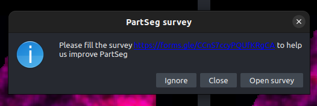

PartSeg surveys
===============

Since the partseg 0.15.3 release there is a new feature that allows
to ask users for fill a survey to help in the PartSeg development.

How it works
------------

Whole logic is implemented in ``PartSeg._launcher.check_survey`` module.

1. Check if ignore file exist and is last modified less than 16 hours ago. If yes, do nothing.
2. Fetch data from https://raw.githubusercontent.com/4DNucleome/PartSeg/develop/survey_url.txt.
   If file do not exists or is empty, do nothing.
   Save fetched data as url to form.
3. Check if ignore file exist and its content is equal to fetched url. If yes, do nothing.
4. Display message to user with information that there is a survey available.

   * If user click "Open survey" button, open browser with fetched url.
   * If user click "Ignore" button, save fetched url to ignore file.
   * If user click "Close" button, touch the ignore file to prevent showing the message again for 16 hours.

.. graphviz::

    digraph flow {
        "start" -> "check if already asked"

        "check if already asked" -> "fetch if exist active survey" [label=No];
        "check if already asked" -> "end" [label=Yes];
        "fetch if exist active survey" -> "end" [label=No];
        "fetch if exist active survey" -> "check if user decided to ignore this survey" [label=Yes]
        "check if user decided to ignore this survey" -> "end" [label=Yes]
        "check if user decided to ignore this survey" -> "show dialog with question" [label=No]
        "show dialog with question" -> "end" [label=Close]
        "show dialog with question" -> "open browser" [label="Open survey"]
        "show dialog with question" -> "Save to not ask about this survey" [label="Ignore"]
        "open browser" -> "end"
        "Save to not ask about this survey" -> "end"
        start [shape=Mdiamond];

        end [shape=Msquare];
    }
