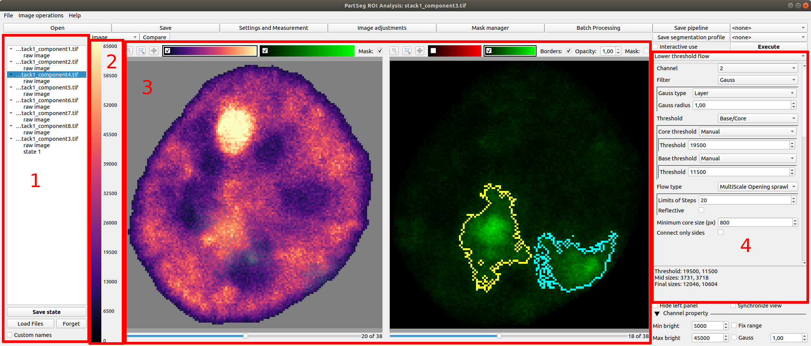
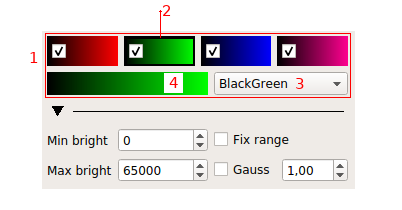
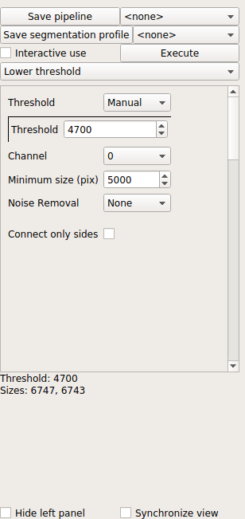

# Graphical User Interface (GUI) overview 

## Analysis GUI

This is main ui for this application

### Color Control

This part of interface is used to control how channels are visualized. 
The main and all time visible part is marked with red frame and number 1.

### Algorithm settings widget

 

[comment]: <> (pandoc -t html -s -o tutorial-chromosome1.html --css pandoc.css -M pagetitle:"Chromosome 1 territory analysis"  tutorial-chromosome1.md) 