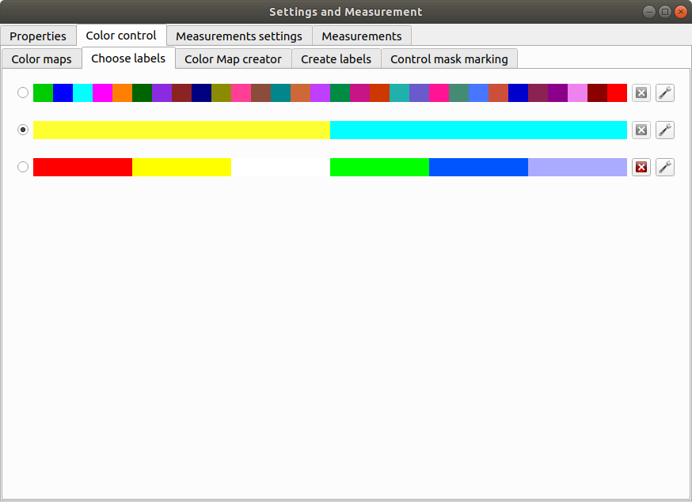
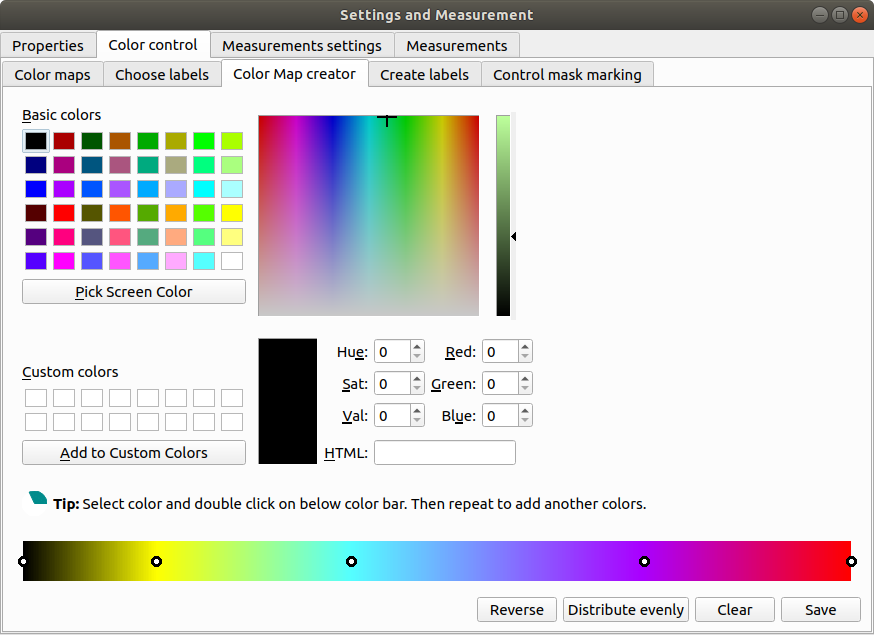
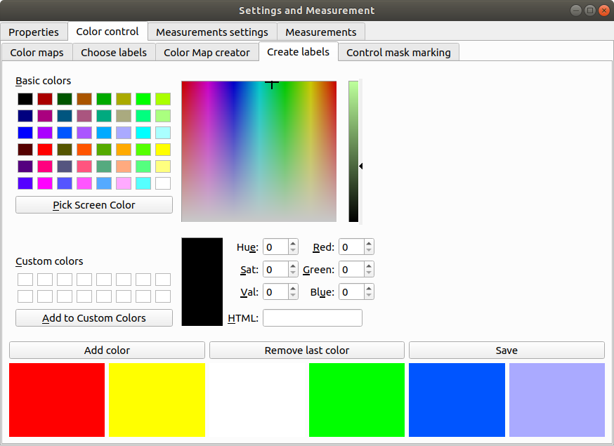
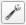

=======================================
Graphical User Interface (GUI) overview
=======================================

:Author: Grzegorz Bokota
:Version: $Revision: 1 $
:Copyright: This document has been placed in the public domain.

.. contents:: Table of Contents

ROI Analysis GUI
----------------

In this section we describe main window of "ROI Analysis".

.. image::  images/main_window.png
   :alt: Main Roi Analysis GUI

1.  Colorbar
2.  Two copy of Image view. Preview of data.
    Image view is described in `Image View`_.
3.  Algorithm parameters. Here you set parameters for segmentation.

Measurement
~~~~~~~~~~~
Here there are described widgets for prepare measurements set and
execute its calculation. Both are available in
"Settings and Measurement" window.

.. image::  images/measurement_prepare.png
   :alt: View on widget for prepare measurement set

Upper part of this widget is designed for manage existing sets.

1. List of already defined measurement set.
2. Preview of selected measurement set.

Buttons below list of existing there are 4 buttons which are used to
control saved ones.

3. List of available measurement.
4. Chosen elements to new measurement set.
5. Select area on which measurement element should be calculated:

   * **Mask** - area of mask
   * **Segmentation** - area of segmentation
   * **Mask without segmentation** area of mask minus area of segmentation

6. If measurement should be calculate:

   * **No** - For whole selected area.
   * **Yes** - For each component of area.
   * **Mean** - For each component of area and then mean value of its.

7. Adding elements to chosen

   *  **→** - Move element to right list.
   *  **←** - Move element to left list. May be useful to create complex one.
   *  **Ratio** - Allow to create ratio of two measurements result.
      First select numerator then click **Ratio** then select denominator
      and press **Ratio** again.
   *  **Clear** - clear chosen element

8. Control single elements of set:

   * **↑** - Move selected element up.
   * **↓** - Move selected element down.
   * **Remove** - Remove selected element.

.. image::  images/measurement_calculate.png
   :alt: View on measurement calculation widget

This widget ia also available as left panel of main window.

1. Area to show result.
2. Select which measurement set need to be calculated.
3. Remove existing result and show result of new calculation.
4. Add result of new calculation to existing ones.

Other controls:

*  Horizontal view - if result should be presented in rows or columns
*  No header - remove column "Name".
*  No units - do not show units
*  Expand - if result of per component calculations should be show in separate
   columns or as inline list ``[res1, res2, ...]``
*  Add file name - add element with file name

   - No
   - Short - only file name
   - Full - ful path to file

*  Channel - on which channel calculation should be performed.
*  Units - in which units show physical values

Profile, Pipeline, Project
~~~~~~~~~~~~~~~~~~~~~~~~~~
In PartSeg We define three ways for saving segmentation:

*  **Profile** - It is saved parameters of one algorithm
*  **Pipeline** - It is saved minimal sequence of segmentation
   and mask operation

Both operation are saved in application but can be managed in
**Properies** tab of **Settings and Measurement** which is describe bellow.

Third option is to save current work as project. Project contains:

*  Raw data image
*  Mask image if present
*  Whole pipeline needed to create current segmentation.
*  All masks and segmentation created in middle steps.

.. image::  images/segmentation_advanced.png
   :alt: View on Properties Tab in Settings and Measurement.

1.  Image spacing with units.
2.  Control of mask presenting. Its color and opacity.
3.  If show multiple files widget in main window.
4.  List of segmentation profiles.
5.  List of segmentation pipelines.
6.  Preview of selected Profile/pipeline

Additionally, bellow preview there are 6 buttons.
We think that they are self explanatory with addition that,
when profile is selected two bottom ones are "Delete profile"
and "Rename profile".

Batch processing
~~~~~~~~~~~~~~~~

Mask Segmentation GUI
---------------------

Common elements
---------------

Image view
~~~~~~~~~~

Color control
~~~~~~~~~~~~~

PartSeg give user option to use custom colormap
to adjust parameters of intensity presentation.
For multichannel image PartSeg use maximum projection
to calculate final view.

Also segmentation labels can be adjusted.
If more labels is need than is defined then
they are defined in cyclic way.

Here we describe widget used for control this elements.

Color maps
^^^^^^^^^^
.. image:: images/colormap_list.png
   :alt: View on list of color maps

*  Only color maps with checked checkbox are available to select in
   `Image View`_ controls.
*  Only custom created color maps can be deleted with |delete| button.
*  Part of existing color maps (all custom) can be use as base to new
   after click |edit| button.

Choose labels
^^^^^^^^^^^^^

In this tab User can chose labels coloring scheme.

*  Current scheme is chosen with radio button (|radio_button|) on left.
*  Custom schemes can be deleted with |delete| button.
*  New scheme can be defined based on old one after click |edit| button.

Color Map creator
^^^^^^^^^^^^^^^^^

After select color double click on bottom bar to create marker.

Markers can be moved by drag and drop or removed by double click on them.
Values between markers are created with linear interpolation.

Create labels
^^^^^^^^^^^^^

After select color use **Add color** buton.
Color order can be changed by drag and drop.

Algorithm settings
~~~~~~~~~~~~~~~~~~
This is widget for chose algorithm and set it parameters.

.. image:: images/algorithm_settings.png
   :alt: Algorithm settings

1. This is drop down list on which user can select algorithm.
2. In this area user set parameters of algorithms.
3. In this area there are show additional information produced by algorithm.

Mask manager
~~~~~~~~~~~~
This widget/dialog allows to set parameters of transferring
segmentation into mask.

.. image:: images/mask_manager.png
   :alt: Mask Manager

1. Select to use dilation (2d or 3d) with set
   its radius. If dilation is in 3d then z radius is calculated
   base on image spacing.
2. If fill holes in mask. Hole is background part
   not connected to border of image. If Maximum size is set to -1
   then all holes are closed.
3. **Save components instead** of producing binary mask.
   **Clip previous mask** is useful when using positive radius in Dilate mask
   and want to fit in previous defined mask.
4. Negate produced mask.
5. Show calculated dilation radius for current image.
6. Undo last masking operation.
7. Create new mask or go to previously undone one.
8. TODO
9. TODO

Multiple files widget
~~~~~~~~~~~~~~~~~~~~~
This is widget to manage work on multiple files without need
to reload it from disc.

Each element of top level list is one file.
For each saved

.. image:: images/multiple_files_widget.png
   :alt: Multiple files widget

1.  List of opened files.
2.  Save current image state to be possible to reload.
3.  Remove saved state.
4.  Load multiple files to PartSeg.
5.  When click **Save State** open popup with option to set
    custom name instead of default one.

.. |delete| image:: images/delete.png

