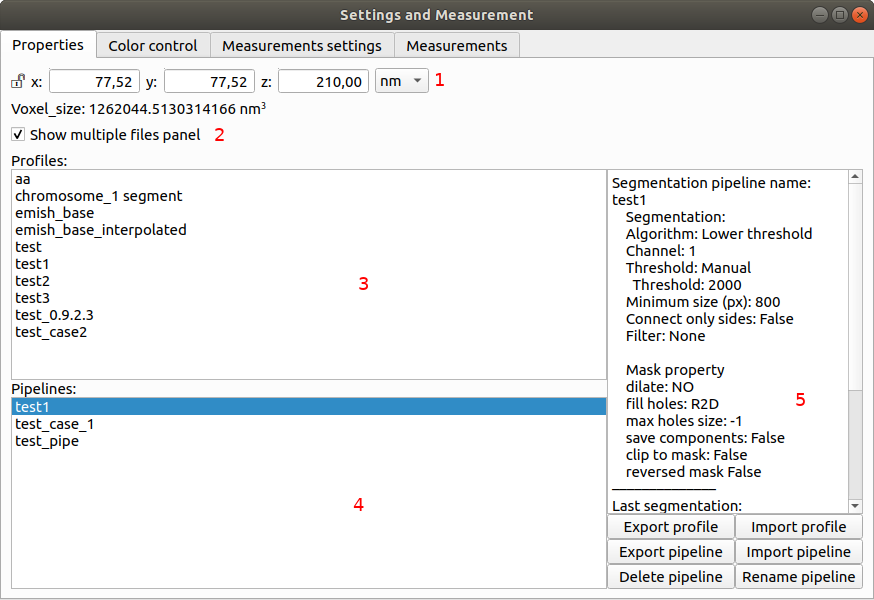
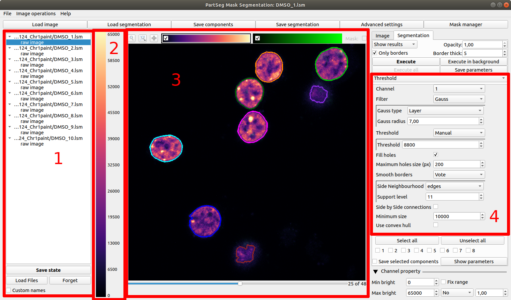
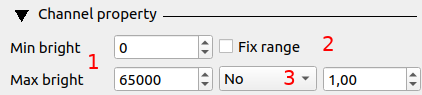
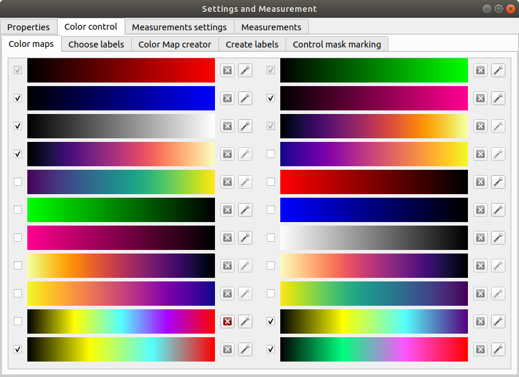

=======================================
Graphical User Interface (GUI) overview
=======================================

:Author: Grzegorz Bokota
:Version: $Revision: 1 $
:Copyright: This document has been placed in the public domain.

.. contents:: Table of Contents

ROI Analysis GUI
----------------

In this section we describe main window of "ROI Analysis".

.. image::  images/main_window.png
   :alt: Main Roi Analysis GUI

1.  `Multiple files widget`_ for manage multiple files.
    Visible only if enabled in Settings and Measurements
    (described in `Profile, Pipeline, Project`_)
2.  Colorbar - Preview how current colors maps on brightness.
    Presented colormap is changed by selection channel in `Image View`_.
3.  Two copy of `Image View`_.
    Left is for preview raw data or see freezed view on segmentation.
4.  `Algorithm parameters`_. Here you set parameters for
    segmentation algorithm.

Above colorbar there are two controls:

5.  Change if left panel should contain view on image or measurement.
6.  Copy segmentation from right view.
    Allows precise comparison of segmentation.
    Visible only when image is selected with control 5.

7.  Save current pipeline in memory.
    Name of pipeline is is set in dialog window.
8.  Chose which pipeline should be applied to data.
9.  Save current algorithm ands its parameters.
10. Select profile to be applied.
11. If segmentation should be recalculated on every parameters change,
    or only after "Execute" click.
12. Execute segmentation algorithm.

On top of window there are also 6 buttons:

*   **Open** - load data.
*   **Save** - save data.
*   **Settings and Measurement** - open window with:
    Properties_, `Color control`_ and `Measurement`_.
*   **Image adjustments** - image transformation.
    Currently only Interpolation and swap Time and Z.
*   **Mask manager** - Open `Mask manager`_ to create
    mask from current segmentation.
*   **Batch processing** - Open `Batch processing`_ window

Below Algorithm parameters there are two checkbox:

*   **Hide left panel** - as name. Useful for tight screen.
*   **Synchronize view** - for synchronization both image views:
    Zoom, layer, and X,Y position.

Measurement
~~~~~~~~~~~
Here there are described widgets for prepare measurements set and
execute its calculation. Both are available in
"Settings and Measurement" window.

Upper part of this widget is designed for manage existing sets.

1. List of already defined measurement set.
2. Preview of selected measurement set.

Buttons below list of existing there are 4 buttons which are used to
control saved ones.

3. List of available measurement.
4. Chosen elements to new measurement set.
5. Select area on which measurement element should be calculated:

   * **Mask** - area of mask
   * **Segmentation** - area of segmentation
   * **Mask without segmentation** area of mask minus area of segmentation

6. If measurement should be calculate:

   * **No** - For whole selected area.
   * **Yes** - For each component of area.
   * **Mean** - For each component of area and then mean value of its.

7. Adding elements to chosen

   *  **→** - Move element to right list.
   *  **←** - Move element to left list. May be useful to create complex one.
   *  **Ratio** - Allow to create ratio of two measurements result.
      First select numerator then click **Ratio** then select denominator
      and press **Ratio** again.
   *  **Clear** - clear chosen element

8. Control single elements of set:

   * **↑** - Move selected element up.
   * **↓** - Move selected element down.
   * **Remove** - Remove selected element.

This widget ia also available as left panel of main window.

1. Area to show result.
2. Select which measurement set need to be calculated.
3. Remove existing result and show result of new calculation.
4. Add result of new calculation to existing ones.

Other controls:

*  Horizontal view - if result should be presented in rows or columns
*  No header - remove column "Name".
*  No units - do not show units
*  Expand - if result of per component calculations should be show in separate
   columns or as inline list ``[res1, res2, ...]``
*  Add file name - add element with file name

   - No
   - Short - only file name
   - Full - ful path to file

*  Channel - on which channel calculation should be performed.
*  Units - in which units show physical values

Profile, Pipeline, Project
~~~~~~~~~~~~~~~~~~~~~~~~~~
.. _Properties:

In PartSeg We define three ways for saving segmentation:

*  **Profile** - It is saved parameters of one algorithm
*  **Pipeline** - It is saved minimal sequence of segmentation
   and mask operation

Both operation are saved in application but can be managed in
**Properties** tab of **Settings and Measurement** which is describe bellow.

Third option is to save current work as project. Project contains:

*  Raw data image
*  Mask image if present
*  Whole pipeline needed to create current segmentation.
*  All masks and segmentation created in middle steps.

1.  Image spacing with units.
2.  Control of mask presenting. Its color and opacity.
3.  If show multiple files widget in main window.
4.  List of segmentation profiles.
5.  List of segmentation pipelines.
6.  Preview of selected Profile/pipeline

Additionally, bellow preview there are 6 buttons.
We think that they are self explanatory with addition that,
when profile is selected two bottom ones are "Delete profile"
and "Rename profile".

Batch processing
~~~~~~~~~~~~~~~~

Prepare batch plan
^^^^^^^^^^^^^^^^^^

1. List of already defined bath plan.
   Above buttons allow to manage them.
2. Preview of currently selected plan from saved one.
3. Preview on current edited plan.
4. Selection of root type:

   * Image - only image is loaded. As input file can be used any of
     image, ROI project, mask project
     (each component is loaded as separated entry).
   * Project - load whole ROI project as it is.
   * Mask project - load image with mask. Possible entry:
     ROI project, mask project

   and adding save operation to plan.

5. Selection of segmentation profile or pipeline to be add to plan.
6. Selection of measurement set to be add to plan.
7. Preview of already selected pipeline/profile/measurement.
8. Mask creation widget. Mask can hev set name for past reference.
   It has 3 states:

   * Load mask from file:

     |batch_mask_from_file|

     + Suffix - add suffix to create file name.
     + Replace - use substitution in file name to create mask name.

   * Create mask from segmentation. This is described
     in `Mask manager`_ in `Common elements`_

     |batch_mask_from_segmentation|

   * Create mask from other masks

     |batch_mask_from_masks|

     + Mask sum
     + Mask intersection

Execute batch
^^^^^^^^^^^^^

.. _select multiple files:

Mask Segmentation GUI
---------------------

1.  `Multiple files widget`_ for manage multiple files.
    Visible by default. can be hide in `image tab`_.
2.  Colorbar - Preview how current colors maps on brightness.
    Presented colormap is changed by selection channel in `Image View`_.
3.  `Image View`_. In this GUI control of segmentation result presentation
    is above algorithm parameters.
4.  `Algorithm parameters`_. Here you set parameters for
    segmentation algorithm.

5.  Select how present segmentation result:

    * Not show - disable showing, for better data preview.
    * Show result - show whole algorithm output.
    * Show chosen - show only components selected in widget
      bellow algorithm segmentation

6.  Segmentation component marker opacity.
7.  Mark segmentation only by borders or by masking whole area.
8.  If segmentation is marked by borders then set it thick.
    Useful for big images.
9.  Execute segmentation.
10. Execute segmentation in background. Result will be put
    in `Multiple files widget`_ as entry.
11. Execute in batch mode. Execution will be done on
    files selected in `image tab`_.
12. Save parameters of current algorithm to json file.

13. Select all components as properly selected.
14. Remove selection from all checkbox.
15. Selection of components. Selection can be also
    changed by click on component on `Image view`_.
    When mouse is over checkbox given component is
    marked by frame on `Image view`_.
16. Select if chosen components should be saved over next segmentation.
    ``TODO add example``
17. For each component show parameters used for segmentation.

Here there is description of image tab:

.. _image tab:

1. Information about image.
2. Widget to select files for batch processing.
   It is described in `select multiple files`_ part of
   `Batch processing`_ from `ROI Analysis GUI`_.
3. Control if show multiple files widget.

Common elements
---------------
In this section there are described elements which are
common for "ROI Analysis GUI" and "Mask Segmentation GUI".

Image view
~~~~~~~~~~
Zoom of image can be also changed by Ctrl+Mouse scroll.

1.  Reset Zoom.
2.  Enable zoom bay mark area.
3.  Shifting image by mouse.
4.  Channel view control. Only Channels with selected checkbox
    are visible. `Color map`_ for current channel
    can be selected when click in triangle in upper right corner
    |channel_select|. This triangle is visible when mouse is over widget.
5.  Mark segmentation only by borders or by masking whole area.
6.  Set opacity of segmentation marking.
7.  Mark mask visible.
8.  Control which layer is visible.
    If image contains time data, then similar
    slider will be visible on left part of image.

1.  Set boundaries for minimum maximum brightness for given channel.
2.  Use boundaries for presenting current channel.
    If is checked then lock is present right to checkbox |fixed_range|.
3.  Use gaus for presenting current channel.
    If is checked then proper symbol is present right to checkbox |gauss|.

Color control
~~~~~~~~~~~~~

PartSeg give user option to use custom colormap
to adjust parameters of intensity presentation.
For multichannel image PartSeg use maximum projection
to calculate final view.

Also segmentation labels can be adjusted.
If more labels is need than is defined then
they are defined in cyclic way.

Here we describe widget used for control this elements.

Color maps
^^^^^^^^^^
.. _Color map:

*  Only color maps with checked checkbox are available to select in
   `Image View`_ controls.
*  Only custom created color maps can be deleted with |delete| button.
*  Part of existing color maps (all custom) can be use as base to new
   after click |edit| button.

Choose labels
^^^^^^^^^^^^^
.. image:: images/label_list.png
   :alt: View on list of label coloring

In this tab User can chose labels coloring scheme.

*  Current scheme is chosen with radio button (|radio_button|) on left.
*  Custom schemes can be deleted with |delete| button.
*  New scheme can be defined based on old one after click |edit| button.

Color Map creator
^^^^^^^^^^^^^^^^^
.. image:: images/create_colormap.png
   :alt: View on color map create widget.

After select color double click on bottom bar to create marker.

Markers can be moved by drag and drop or removed by double click on them.
Values between markers are created with linear interpolation.

Create labels
^^^^^^^^^^^^^
.. image:: images/create_labels.png
   :alt: View on labels map create widget.

After select color use **Add color** buton.
Color order can be changed by drag and drop.

Algorithm parameters
~~~~~~~~~~~~~~~~~~~~
This is widget for chose algorithm and set it parameters.

1. This is drop down list on which user can select algorithm.
2. In this area user set parameters of algorithms.
3. In this area there are show additional information produced by algorithm.

Mask manager
~~~~~~~~~~~~
This widget/dialog allows to set parameters of transferring
segmentation into mask.

.. image:: images/mask_manager.png
   :alt: Mask Manager

1. Select to use dilation (2d or 3d) with set
   its radius. If dilation is in 3d then z radius is calculated
   base on image spacing.
2. If fill holes in mask. Hole is background part
   not connected to border of image. If Maximum size is set to -1
   then all holes are closed.
3. **Save components instead** of producing binary mask.
   **Clip previous mask** is useful when using positive radius in Dilate mask
   and want to fit in previous defined mask.
4. Negate produced mask.
5. Show calculated dilation radius for current image.
6. Undo last masking operation.
7. Create new mask or go to previously undone one.
8. TODO
9. TODO

Multiple files widget
~~~~~~~~~~~~~~~~~~~~~
This is widget to manage work on multiple files without need
to reload it from disc.

Each element of top level list is one file.
For each saved

.. image:: images/multiple_files_widget.png
   :alt: Multiple files widget

1.  List of opened files.
2.  Save current image state to be possible to reload.
3.  Remove saved state.
4.  Load multiple files to PartSeg.
5.  When click **Save State** open popup with option to set
    custom name instead of default one.

.. |delete| image:: images/delete.png
.. |edit| image:: images/edit.png
.. |radio_button| image:: images/radio_button.png
.. |channel_select| image:: images/channel_select.png

.. |gauss| image:: images/gauss.png

