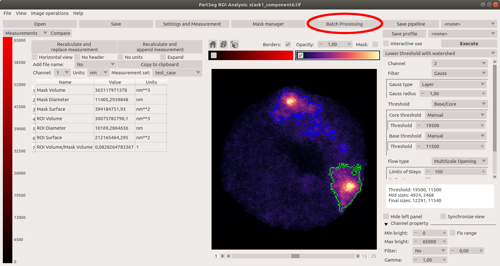
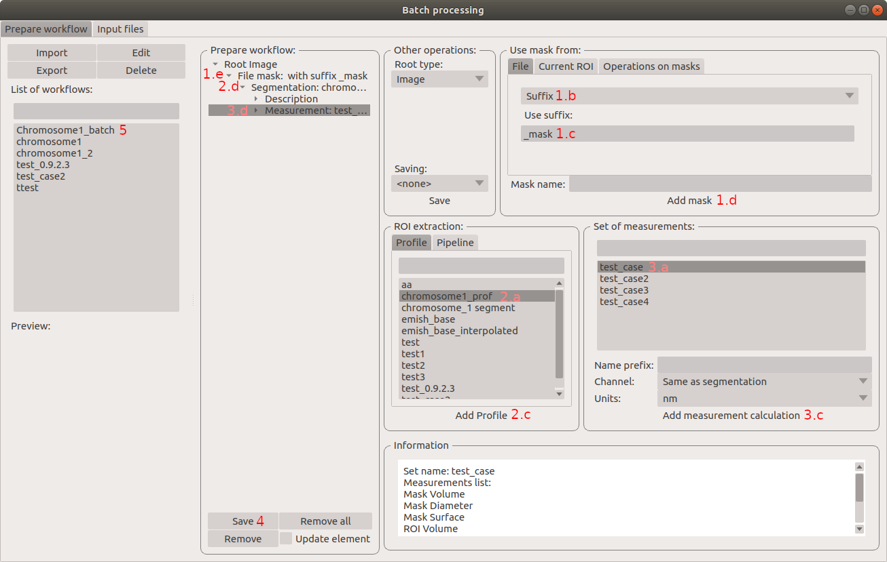
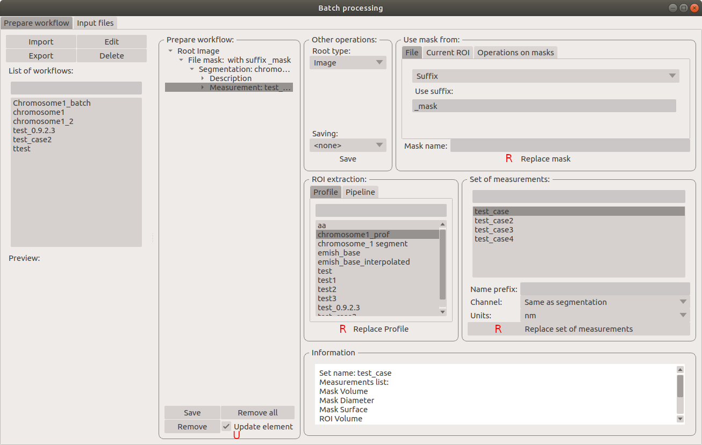
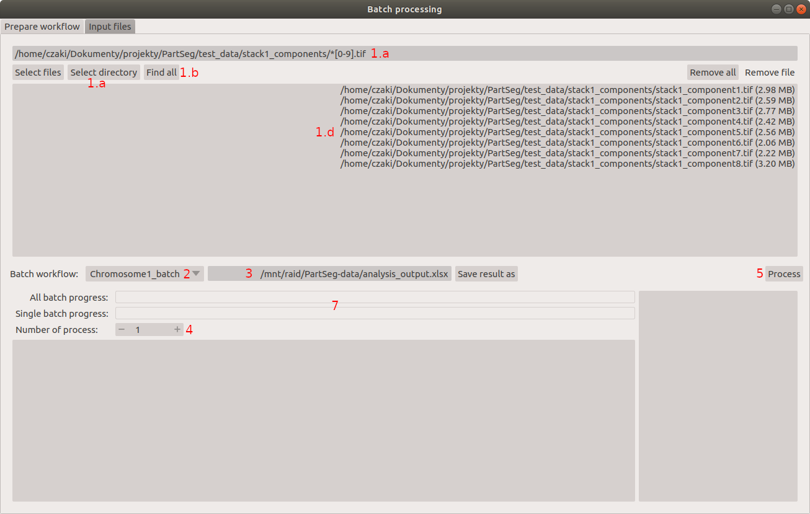
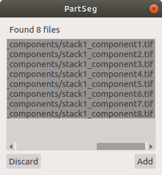
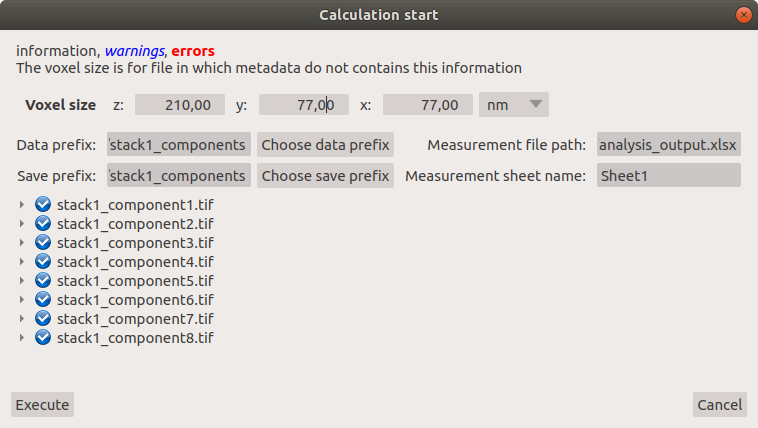

# Batch processing

To open window for batch processing use marked button or use *Batch processing* position in *File* menu

## Create a workflow for a batch processing

1. Select how the mask file for segmentation will be recognized.

   a.  In section *Use mask from*, Select *File* tab.

   b. Select *Suffix*.

   c. Input “\_mask” in  *Use suffix* field. (All masks created by the *ROI Mask* component of Partseg have `_mask` suffix)

   d. Confirm with the "Add mask" button

   e. File mask is now added to the workflow

1. In *Roi Extraction* section

   a. Select profile “chromosome1_prof” created in [chromosome 1 segmentation tutorial](../tutorial-chromosome-1/tutorial-chromosome1_16.md)

   b. All settings used in the selected profile are visible in the *information* section.

   c. Confirm with the "Add Profile/Pipeline" button.

   d. The segmentation profile is now added to the workflow.

1. in section *Set of measurements*:

   a. Select set “test_case” created in [chromosome 1 segmentation tutorial](../tutorial-chromosome-1/tutorial-chromosome1_16.md).

   b. All measurements within the selected set are visible in the *information* section

   c.  Select channel (x) and units (um) that will be used in quantification.

   d.  Confirm with the "Add Set of measurements" button

   e.  The segmentation profile is now added to the workflow (3c).

1. Save created Workflow under the chosen name (e.g. *Chromosome1_batch*) with the "Save" button.

1. A new workflow is now added to a list of workflows.

Note: to change any element of the existing workflow check box *Update element* (**U**) in the workflow edition mode.
Now select each of the elements that need replacement and update using the *Replace* buttons (**R**) in each section.

## Execute created workflow

1. Select list of files to be proceed

   a. using “Select directory” option select directory where files are present and add `/*[0-9].tif` to the path line (see [explanation](<https://en.wikipedia.org/wiki/Glob_(programming)>)) Files created by the Mask Segmentation module of Partseg are saved as tifs, which names composed of the name of the original 3D microscopic picture and component number at the end.

   b. Push "Find All" button to finds all files matching pattern

   c. confirm by the "Add" button.

   

   d. List of files appears in the lower panel.

   Alternatively you could select single files using *Select files* button.

   This list can be expanded by adding individual files or all files from a different directory as is described above. Files can be also removed individually ("Remove file" option (1g)) or globally ("Remove all" option(1h)).

1. Select created workflow in *Batch workflow* (here use *Chromosome1_batch*)

1. Select the name and a place where the resulted *xlsx* file will be stored.

1. Number of the concurrent process can be increased depending on computer power and current usage.

1. Start calculation by confirming with the "Process" button.

   

1. A new popup window will show you a summary. Confirm with the "Execute" button.

1. The progress of processing can be followed in the Single batch progress status bar.

## Data curation

(click to open video)

1. In case some errors are detected during batch processing, a list of files and descriptions of errors appears in the bottom left panel (8).
   Information on errors is automatically sent out and helps us to improve the next version of Partseg.

1. For files with complete segmentation failure a separate spreadsheet entitled "Erorrs" with a list of files will be created to inform the user.

1. Files can be transferred directly from the spreadsheet to the “input file” widget for batch processing.

1. After choosing the workflow used for the batch processing, each file can be opened with a right click of a mouse and verified in "ROI Analysis".

1. Correct segmentation parameters, create a new segmentation profile, and based on it, a new batch workflow, and again process files from the list.

1. The results for each nucleus and each component are present in the spreadsheet saved at the location selected by the user.

1. Use data filtration in the spreadsheet to check for incorrectly segmented and measured structures. Resulting in a list of files, which contain incorrect data can be processed as in 2.
   All spreadsheets created by batch processing include information about settings and parameters used for segmentation and measurement.
