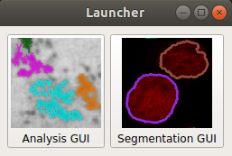
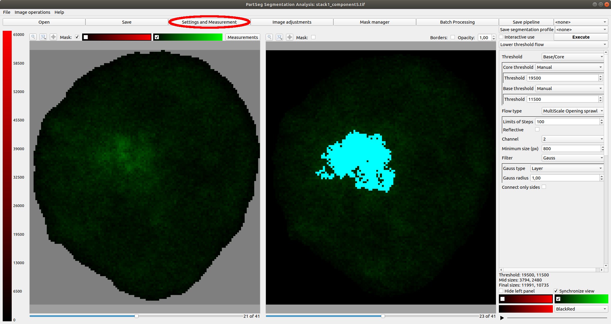
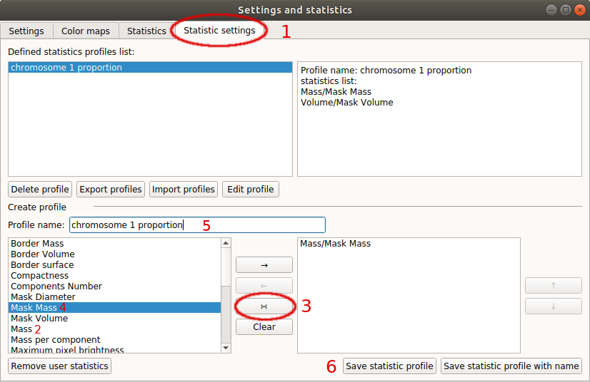
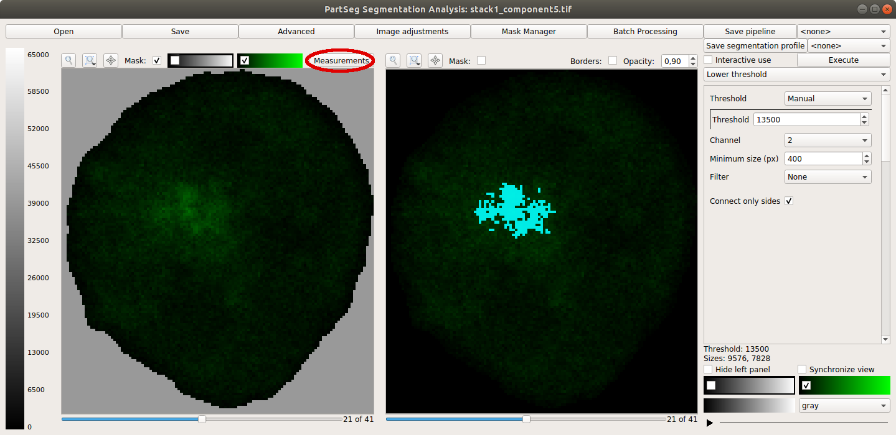
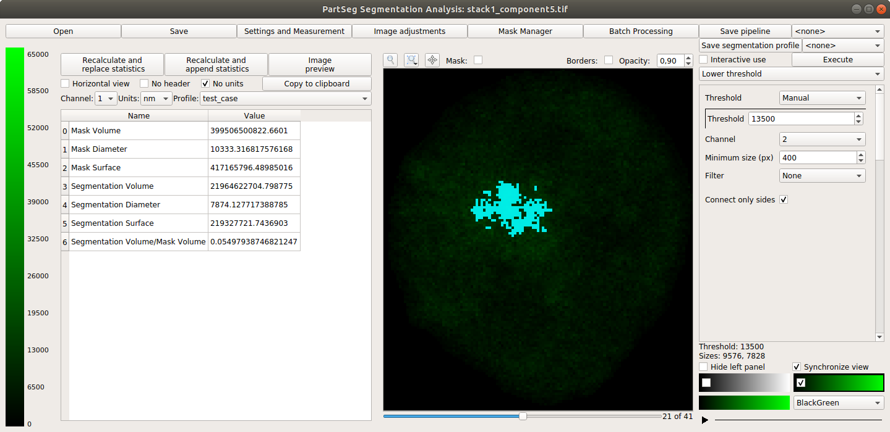

# Chromosome 1 territory analysis 

In this tutorial we will show how to use PartSeg to segment territories of chromosome 1 inside human cell nucleus and then do simple analysis.  

## Use case 

We are dealing with dataset of photos from confocal microscopy obtained with TO-PRO3 probe which is bind non-specyffic to chromatin fiber. This means that it can be assumed that the brighter the voxel of photo is the more chromatin it represends. This dependency is assumed to be linear.
We will use this depndency to tune parameters of segmentation algorithm.

The length of human genome is 3,088 Mbp (milions of base pairs), while the length of chromosome 1 is 248 Mbp. So length of chromosome 1 is ~8% of total length and it contains about 8% of total mass of chromatin inside nucleus.
The length of centromere of chromosome 1 is 7.4 Mbp, so we expect that the probe have marked about 7.7% of chromatin inside nucleus. By trial and error we will use PertSeg to set parameters for segmentation algorithm to find 2 components wchich contains about 7.7% of chromatin.
We assume that each nucleus sould contain 2 copies of chromosome 1. If it is not the case then the cell is under division and such data should not be processed.

We base our analysis on chromatin lenght estimation based on density and not on volume, because of nucleous which takes space but does not contain chromatin. [link1](https://en.wikipedia.org/wiki/Human_genome) [link2](https://en.wikipedia.org/wiki/Chromosome_1) [link3](https://en.wikipedia.org/wiki/Centromere#Positions)

Dataset for this tutorial can be download from [here](http://nucleus3d.cent.uw.edu.pl/PartSeg/Downloads/A_deconv_elements.zip). It contains 16 cut out nuclei with marked chromosome 1 territory. Voxel size is 77x77x210 nm. Data is deconvoluted. Data contains four channels: channel 0 - chromosome 1 territory without centromere.
channel 1 - chromosome 1 telomere 3', channel 2 - chromosome 1 telomere 5', channel 3 - chromatin density inside nucleus. We will use channel 0 for segmentation and channel 1 for verification. As marker does not bind uniformly to chromatin channel 0 cannot be used to estimate chromatin density),

## Analysis steps

### Preparation

1.  Open PartSeg

2.  Click "Analysis GUI" button  
    

3.  Click "Advanced" on top of the window (third from the right)  
    

4.  Choose "Statistic settings" tab (number 1)  
    

5.  Prepare Statistic profile which will giv information about percentage occupancy of segmented region.
    1.  Choose "Mass" from list in lower left part (number 2)
    2.  Click button with symbol ∺ (number 3) 
    3.  Choose "Mask mass" (number 4)
    4.  Again push button with symbol ∺ (number 3)
    5.  Set name of statistic profile (number 5)
    6.  Click button "Save statistic profile" (number 6)
    7.  (optionally) You can repeat steps 1-6 for statistics "Volume" and "Mask Volume" to get more information

### Data process
1.  Load data:
    1.  Click **Open** button or press **ctrl+O** (cmd+O on mac)

    2.  Choose `image with mask` file filter  
        

    3.  Choose data to load

    4.  In next widow choose matching file with `_mask` suffix

    You can also drag and drop both files on main window

2.  Click the "Statistic calculation" to get preview on statistic (number 1)

    

    -   If you prefer to see booth panels and have place on screen you can preview statistic in 
        "Advanced" window in tab "Statistics". These views are independent.

    -   In this view you can see difference between checked and unchecked mask checkbox (number 2).
        The mask coloring property can be set in "Advanced" window in tab "Settings"

3.  In the right panel (number 1) you should chose algorithm (I suggest Lower threshold on beginning). 
    Then set parameters. Don't forget to choose the right channel. And click "Execute" button (number 3)

          

4.  To verify if segmentation is good, in the left panel choose channel with chromatin - in this case it is 3 (number 4)
    and choose statistic set prepared in Preparation part (number 5). Then press "Recalculate and replace statistics" 
    button (number 6)

5.  Based on result decide how to modify parameters of the algorithm.

6.  If the result is only one component then you can try it split using "Lower threshold path euclidean".

## Apendix 
### A little more about statistics 

1.  If you are interested with some statistic which are on the list you can add it to set using button with symbol "→"
2.  If you wold like to remove statistic from set use button with symbol "←"
3.  The statistic profiles can be exported to `.json` file as a backup or to import in another instance.
4.  When user choose profile name in the box in upper left part then its description will show in area on right.
5.  You can set custom names for statistics.

### Segment nucleus from stack
The original deconvoluted stack is available under this [link]([link](http://nucleus3d.cent.uw.edu.pl/PartSeg/Downloads/A_deconv_stack.zip)) 

You can try to improve segmentation by hand. To do it with PartSeg tool on laucher screen choose button "Segmentation GUI". The workflow is similar.

## Additional information
Data collection was carried out with the use of CePT infrastructure financed by the European Union - The European Regional Development Fund within the Operational Programme “Innovative economy” for 2007-2013.

[comment]: <> (pandoc -t html -s -o tutorial-chromosome1.html --css pandoc.css -M pagetitle:"Chromosome 1 territory analysis"  tutorial-chromosome1.md)
