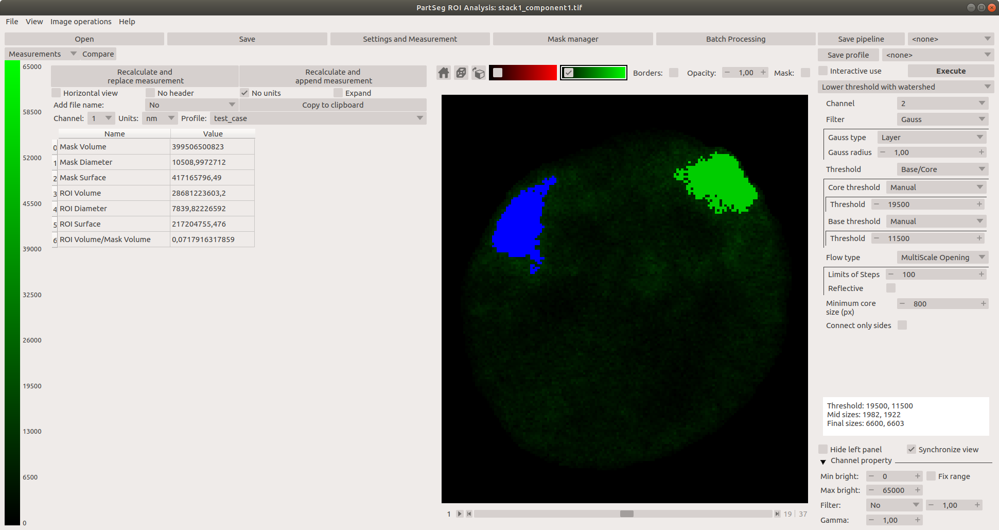

# Chromosome 1 territory analysis 

In this tutorial we will show how to use PartSeg to segment territories of chromosome 1 inside human cell nucleus and then do simple analysis.  

## Dataset 

We are dealing with dataset of photos from confocal microscopy obtained with TO-PRO3 probe which is bind non-specyffic to chromatin fiber. This means that it can be assumed that the brighter the voxel of photo is the more chromatin it represends. This dependency is assumed to be linear.
We will use this depndency to tune parameters of segmentation algorithm.

Dataset for this tutorial can be download from [here](http://nucleus3d.cent.uw.edu.pl/PartSeg/Downloads/A_deconv_elements.zip). It contains 16 catted nucleus with marked chromosome 1 territory.

The length of human genome is 3,088,286,401bp (base pairs), while the length of chromosome 1 is 248,956,422bp. So length of chromosome 1 is ~8% of total length and it contains about 8% of total mass of chromatin inside nucleus.
The length of centromere is 7.4 Mbp. 
So estimated mass of visible under marker is about 7.7% of chromatin inside nucleus.
This analysis cannot base on volume, because of nucleous. [link1](https://en.wikipedia.org/wiki/Human_genome)
[link2](https://en.wikipedia.org/wiki/Chromosome_1) [link3](https://en.wikipedia.org/wiki/Centromere#Positions)

Each nucleus should contain 2 copies of chromosome 1. 
It may happenthat some cell is under division and such data should not be processed.  

1. Data are comes from confocal microscope. Voxel size is 77x77x210 nm   
2. Data contains four channels: 
    * channel 0  - chromosome 1 territory (without centromere). Marker do not bind uniformly to 
    chromatin so this data cannot be used to estimate chromatin density.  
    * channel 1 - chromosome 1 telomere 3'
    * channel 2 - chromosome 1 telomere 5'
    * channel 3 - chromatin density inside nucleus
3. Data are deconvoluted

## Sample data process

### Preparation

1. Open PartSeg
2. Press "Analysis GUI" button  
    
3. Press "Advanced" on top of the window (third from the right)  
    
4. Choose "Statistic settings" tab (number 1)  
     
5. Prepare Statistic profile which will giv information about percentage occupancy of segmented region.
    1. Choose "Mass" from list in lower left part (number 2)
    2. Press button with ∺ symbol (number 3) 
    3. Choose "Mask mass" (number 4)
    4. Again push button with ∺ symbol (number 3)
    5. Set name of statistic profile (number 5)
    6. Push button "Save statistic profile" (number 6)
    7. (optionally) you can do it with "Volume" and "Mask Volume" to get more information  
       

### Data process
1. Load data:
    1. Push **Open** button or press **ctrl+O** (cmd+O on mac) 
    2. Choose `image with mask` file filter  
    
    3. Choose data to load
    4. In next widow choose matching file with `_mask` suffix
    
    You can also drag and drop both files on main window
2. Push the "Statistic calculation" to get preview on statistic (number 1)  
 
    * If you prefer to see booth panels and have place on screen you can preview statistic in 
    "Advanced" window in tab "Statistics". This views are independent.
    * On this view you can see difference between checked and unchecked mask checkbox (number 2).
    The mask coloring property can be set in "Advanced" window in tab "Settings" 
3. In the right panel (number 1) you should chose algorithm (I suggest Lower threshold on beginning). 
Then set parameters. Remember channel is important. And press "Execute" button (number 3)    
      

4. To verify if segmentation is good in left panel choose channel of chromatin - in this case it is 3 (number 4)
and choose statistic set prepared in Preparation part (number 5). And then press "Recalculate and replace statistics" 
button (number 6)

5. Base on result decide how to modify parameters of algorithm.
6. If result is only one component then I suggest to try it split using "Lower threshold path euclidean" to 
split it on components.
  
    
## Apendix 
### A little more about statistics 

1. If you are interested with some statistic which are on the list you can add 
it to set using button with symbol "→"
2. If you wold like to remove statistic from set use button with symbol "←"
3. The statistic profiles can be exported to `.json` file as a backup or to import in another instance.
4. When user choose profile name in the box in upper left part then its description will show in area on right.
5. You can set custom names for statistics 
  
### Segment nucleus from stack
The original deconvoluted stack is available under this [link]([link](http://nucleus3d.cent.uw.edu.pl/PartSeg/Downloads/A_deconv_stack.zip)) 

You can try to improve segmentation on your hand. 
To do it with PartSeg tool on laucher screen choose button "Segmentation GUI"

the workflow is similar but in current stage tool is more primitive than main.   

[comment]: <> (pandoc -t html -s -o tutorial-chromosome1.html --css pandoc.css -M pagetitle:"Chromosome 1 territory analysis"  tutorial-chromosome1.md)