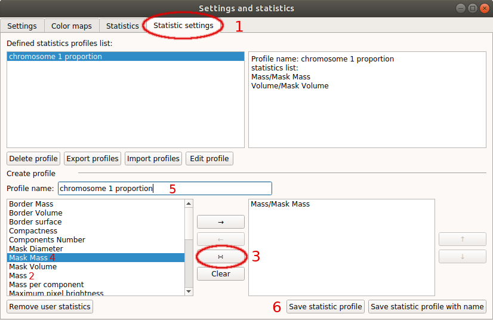

# Chromosome territory analysis

### Use case
This tutorial shows how to segment nuclei from 3D confocal images and later how to analyse several parameters of chromosomal territories of chromosome 1 ausing PartSeg.
Rat postmitotic neurons were fixed and subjected to fluorescent in situ hybridization (FISH)
with chromosome paint probes specyfic to chromosome 1. Nuclei were counterstained with Hoechest, which binds specyfically to DNA. Next 3D images were acquired in 16-bit using confocal microscope. As postmitotic neurons have always exactly 2 copies of each chromosome, cells with more than 2 copies are excluded from the analysis.

Dataset for this tutorial can be downloaded from [here](http://nucleus3d.cent.uw.edu.pl/PartSeg/Downloads/A_deconv_elements.zip). It contains 5 z-stacks with marked chromosome 1 territory. Voxel size is 77x77x210 nm. Data contains 2 channels: channel 1 represents DNA staining and channel 2- chromosome paint probe. Information from channel 1 was used for the segmentation of nuclei and masks generation. Based on created masks nuclear volume, diameter and surface were calculated in later analysis. In order to segment chromosomal territories treshold on channel 1 was adjusted to cover whole chromosome paint staining. Later several parameters of segmented components like: volume, number and surface etc. were calculated.

## Analysis steps

#### Segmentation of nuclear volume and creation of masks

1. Open PartSeg
2. Select "Mask Segmentation"
    
3. Load image
    
4. Ensure that threshold segmentation method is selected
5. Choose threshold parameters:
    1. Channel: 1
    2. Threshold: Manual
    3. Threshold: 8000 (of channel brightness value)
    4. Minimum size: 100000 pixels
    5. Enable "small holes"
    6. Maximum holes size: 800 pixels
    7. Enable "smooth borders"
    8. Smooth borders radius: 1 pixel
    9. Filter: Gauss
    10. Gauss type: layer
    11. Gauss radius: 1
    12. Enable "use convex_hull"
6. Execute
7. Select nuclei that segmented correctly (where mask includes whole volume of a single nucleus) by clicking one by one on the picture.
If all nuclei are segmented properly use "Select all" option. The borders of segmentation are visible after enabling "show results" option.
After the first iteration the rest of nuclei can be subjected to another round of segmentation with a higher threshold.
8. Each of segmented and selected nuclei and it's mask can be saved as separate 3D tif image using "Save components" option.
Images containing all channels of the original picture are saved under the initial name with a "component" and number added. Mask files are saved with the same name, but bearing suffix:_mask.
9. The whole segmentation can be saved separately ("Save segmentation" option) and later can be loaded using "Load segmentation" menu.

#### Segmentation of chromosome 1 territories

1. Open PartSeg
2. Select "Segmentation Analysis"
    
3. Load data:
    1. Select **Open** button or press **ctrl+O** (cmd+O on mac)
    2. Select `image with mask`
    
    3. Select image to load: "stack1_component5.tif"
    4. Select matching mask file in the next step: "stack1_component5_mask.tif"
You can also simply drag and drop both files on the main window.
4. Enable "Synchronise view" option
5. Disable channel 1 (DNA staining) on both windows
6. Enable "Mask" option on the left pannel
7. Select lower threshold option
8. Set Threshold to Manual
9. Set Threshold to 13500
10. Excecute segmentation
Threshold was adjusted to cover whole chromosome paint staining. Some background signal is always present in FISH, however specyfic signal is much brighter. As an example nucleus with two separate chromosome 1 territories is shown, nevertheless chromosomes can reside in close proximity and segment as one component.

#### Measurements settings
1. Open "Advanced" option
    
2. Select "Measurements settings"
    
3. Prepare profile of parameters for chromosome 1 territories analysis.
In this example we show how to measure volume, diameter and surface of a whole nucleus (calculated based on created mask) and volume, diameter and surface of chromosome 1 territories (these parameters are calculated based on a set threshold). In addition we calculated ratio of chromosome 1 to nucleus volume to show how big is chromosome 1 in relation to the whole nucleus.
  A. First introduce name "test_case" for created profile.
  B. Next select parameters calculated for the whole nucleus, which are based on mask: Therefore select "Mask" for option "Area" and "No", for option "Components". From the list of parameters in the left pannel select: Volume, Diameter and Surface. Confirm each parameter by adding it to created profile shown in the right pannel (use button with symbol "→" to confirm).
  C. Next select parameters calculated for chromosome 1 territory: Select "Segmentation" for option "Area" and "No", for option "Components" and again from the list of parameters on the left select: Volume, Diameter and Surface.

# (tu nie mam pewności, rozumiem, że opcja "yes" mierzy dla kazdego komponentu oddzielnie?)

  D. At the end, create ratio of volume of chromosome 1 to the whole nucleus volume. Select "volume" parameter for segmentation like in C, next click on the button with symbol ∺ (number x on the attached image) and select "volume" parameter for mask like in B. Confirm by adding newly created ratio to the profile. Note that newly created ratio can be added as a new parameter to the list in the left pannel and use in future analyses. Select new parameter from created profile and transfer it to the list on the left side by using button with symbol "←".
  E. At the end save your profile with a specyfic name (test_case in our example).
  The parameter profiles can be exported to `.json` file as a backup and future import.

#### Measurements
1. In "Advanced" menu check for "Properties". The pixel size and an voxel depth should be the same as the orginal image. The rest of measurements depends on these properties, so make sure they are correct.
2. Next select "Results" to get a preview on actual measurements (number 1)

Select channel 1 and profile "test_case" created in the last paragraph. Enable Horizontal view and "no units" option. Select "calculte and append results". Resulting table can be copied to any text or spreadsheed file using "copy to clipboard" option. 2. Next, open file "stack1_component1.tif" and load mask file "stack1_component1_mask.tif. Without changing any parameters select "Calculate and append results" once more. Second line of results shows the same set of measurements for second nucleus.

### Segment nucleus from stack
The original stacks is available here: [link]([link](http://nucleus3d.cent.uw.edu.pl/PartSeg/Downloads/A_deconv_stack.zip))

[comment]: <> (pandoc -t html -s -o tutorial-chromosome1.html --css pandoc.css -M pagetitle:"Chromosome 1 territory analysis"  tutorial-chromosome1.md)
