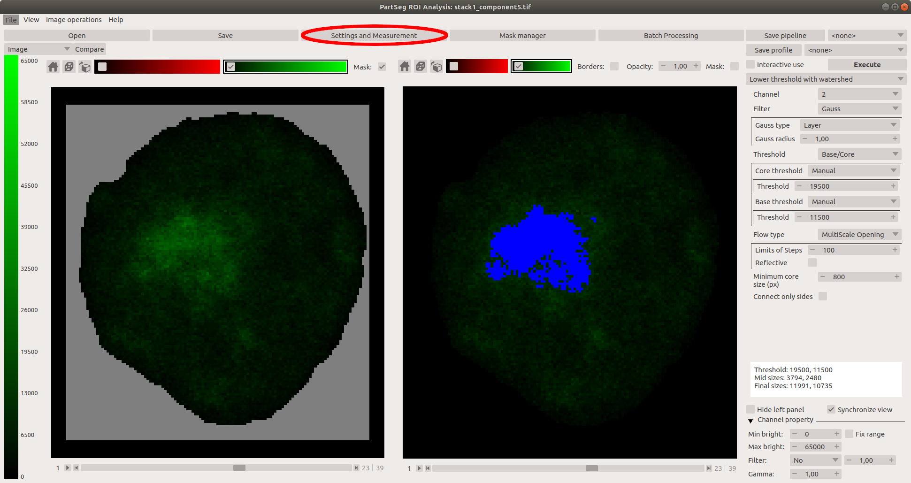

# Chromosome territory analysis

This tutorial shows how to segment nuclei from 3D confocal images and later how to analyse several parameters of chromosomal territories of chromosome 1 and 16 using PartSeg.

## Use case

Rat postmitotic neurons were fixed and subjected to fluorescent in situ hybridization (FISH)
with chromosome paint probes specyfic to chromosome 1 and chromosome 16.
Nuclei were counterstained with Hoechest, which binds to DNA. Next 3D images were acquired in 16-bit using confocal microscope.

Postmitotic neurons have always exactly 2 copies of each chromosome, so cells with more than 2 copiers are excluded from the analysis.
The length of rat chromosome 1 is 282 Mbp, and chromosome 16 is around 90 Mbp, which constitutes for 9% and 3% of the whole genome accordingly.
As chromatin takes up to 60% of nuclear volume (ROUQUETTE et all. 2009), we assumed that chromosome 1
should not be bigger than 5% of total nuclear volume, and chromosome 16 should be 3 times smaller than chromosome 1.
Moreover chromosome paint probes usually don't cover whole length of chromosomes, as highly repetitive sequences are hard to amplify (cytowanie).

Dataset for this tutorial can be download from [here](http://nucleus3d.cent.uw.edu.pl/PartSeg/Downloads/A_deconv_elements.zip). It contains 5 z-stacks with marked chromosome 1 territory. Voxel size is 77x77x210 nm. Data contains 2 channels: channel 1 - DNA staining and channel 2- chromosome territory. Information form channel 1 was used for the segmentation of nuclei volume and mask generation. Nuclear volume and diameter and sum of pixel brightness were calculated based on created masks. Channel 1 was used for segmentation of chromosomal territories. Threshold was adjusted to cover whole chromosome paint staining and several parameters like: components volume, number and surface were calculated using PartSeg.

## Analysis steps

### Segmentation of nuclear volume and creation of masks

1. Open PartSeg
2. Select "Mask Segmentation"
    
3. Load image
    
4. Ensure that threshold segmentation method is selected
5. Choose threshold parameters:
    1. Channel: 1
    2. Threshold: Manual
    3. Threshold: 8000 (of channel brightness value)
    4. Minimum size: 100000 pixels
    5. Enable "small holes"
    6. Maximum holes size: 800 pixels
    7. Enable "smooth borders"
    8. Smooth borders radius: 1 pixel
    9. Filter: Gauss
    10. Gauss type: layer
    11. Gauss radius: 1
    12. Enable "use convex_hull"
6. Execute
7. Select nuclei that segmented correctly (where mask includes whole volume of a single nucleus) by clicking one by one on the picture.
If all nuclei are segmented properly use "Select all" option. The borders of segmentation are visible after enabling "show results" option.
After the first iteration the rest of nuclei can be subjected to another round of segmentation with a higher threshold.
8. Each of segmented and selected nucleus and it's mask can be saved as separate 3D tif image using "Save components" option.
Images containing all channels of the original picture are saved under the initial name with a "component" and number added. Mask files are saved with the same name, but bearing suffix:_mask.
9. The whole segmentation can be saved separately using "Save segmentation" option and can be loaded using "Load segmentation" option.

### Segmentation of chromosome 1 territories

1. Open PartSeg
2. Select "Segmentation Analysis"
    
3. Load data:
    1. Select **Open** button or press **ctrl+O** (cmd+O on mac)
    2. Select `image with mask`
    
    3. Select image to load: "stack1_component5.tif"
    4. Select matching mask file: "stack1_component5_mask.tif"
You can also simply drag and drop both files on the main window.
4. Enable "Synchronise view" option
5. Disable channel 1 (DNA staining) on both windows
6. Enable "Mask" option on the left pannel
7. Select lower threshold option
8. Set Threshold to Manual
9. Set Threshold to 13500
10. Excecute segmentation
Threshold was adjusted to cover whole chromosome 1 staining. Some background signal is always present in FISH, however specyfic signal is much brighter. As an example nucleus with two separate chromosome 1 territories is shown, nevertheless chromosomes can reside in close proximity and segment as one component.
### Parameteres settings
1. Open "Advanced" option
    
2. Select "Parameteres settings"
    
3. Prepare profile of parameters for chromosome 1 territories analysis.
In this example we are interested in a volume, diameter and surface of a whole nucleus (these parameters are calculated based on created mask) and chromosome 1 territories (these parameters are calculated based on set threshold).
First introduce name for created profile.
Next select parameters calculated for the whole nucleus based on mask:
A. Select "Mask" from option "Area" and "No", for option "components"
B. From the list of parameters on the left select: Volume, Diameter and Surface, and confirm each by adding them to created profile shown in the right pannel.

    4. Partseg allows to calculate ratios of different parameters. To create ratio, select first parameter, click button with symbol ∺ (number 3), select second parameter and confirm.
    5. At the end Save your profile with specyfic name (number 5).

2. Select the "Statistic calculation" to get preview on statistic (number 1)

    * If you prefer to see booth panels and have place on screen you can preview statistic in
    "Advanced" window in tab "Statistics". These views are independent.
    * In this view you can see difference between checked and unchecked mask checkbox (number 2).
    The mask coloring property can be set in "Advanced" window in tab "Settings"
3. In the right panel (number 1) you should choose algorithm (I suggest Lower threshold on beginning).
Then set parameters. Don't forget to choose the right channel. And click "Execute" button (number 3)

4. To verify if segmentation is good, in the left panel choose channel with chromatin - in this case it is 3 (number 4)
and choose statistic set prepared in Preparation part (number 5). Then press "Recalculate and replace statistics"
button (number 6)

5. Based on result decide how to modify parameters of the algorithm.
6. If the result is only one component then you can try it split using "Lower threshold path euclidean".
Open "Advanced" option
    
4. Select "Parameteres settings"
    
5. Prepare profile of parameters of segmented nuclei and components within (chromosomal territories)
In this example we are interested in a volume, diameter and surface of a whole nucleus (these parameters are calculated based on created mask) and chromosome 1 territories (these parameters are calculated based on set threshold on h).
From the list of parameters on left choose interesting positions for selected objects (mask- in this case nuclei, and segmentation- here chromosome territories).
    1. Select "Mask" from list on the left
    2. Next from the parameter list choose Volume, Diameter and Surface, and add them to created profiles
    3. Repeat the actions for "Segmentation"
    4. Partseg allows to calculate ratios of different parameters. To create ratio, select first parameter, click button with symbol ∺ (number 3), select second parameter and confirm.
    5. At the end Save your profile with specyfic name (number 5).

## Apendix
### A little more about measured parameters

1. To add more parameters to the analysis select the parameter in the left pannel and confim using button with symbol "→", new parameter will be transfered to the right pannel
2. To remove parameters from the analysis select the parameter name in the right pannel and confim using button with symbol "←"
3. The parameter profiles can be exported to `.json` file as a backup and future import.
4. When user choose profile name in the box in upper left part then its description will show in area on right.
5. You can set custom names for statistics.

### Segment nucleus from stack
The original stacks is available here: [link]([link](http://nucleus3d.cent.uw.edu.pl/PartSeg/Downloads/A_deconv_stack.zip))

You can try to improve segmentation manually. To do it with PartSeg tool on laucher screen choose button "Segmentation GUI". The workflow is similar.

[comment]: <> (pandoc -t html -s -o tutorial-chromosome1.html --css pandoc.css -M pagetitle:"Chromosome 1 territory analysis"  tutorial-chromosome1.md)
