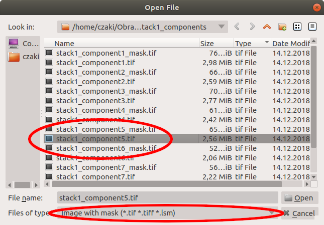
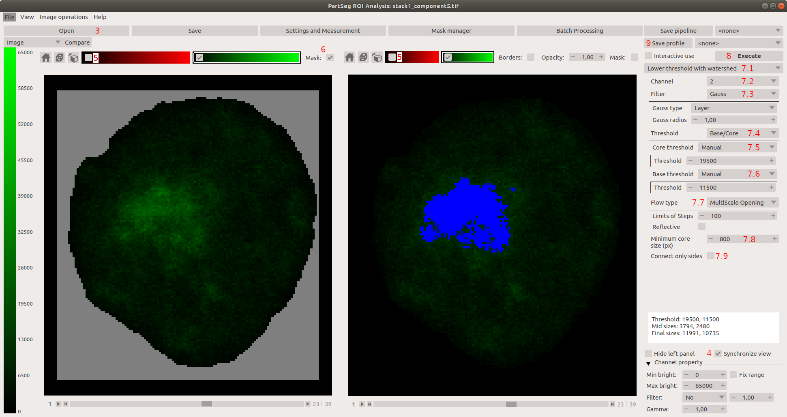
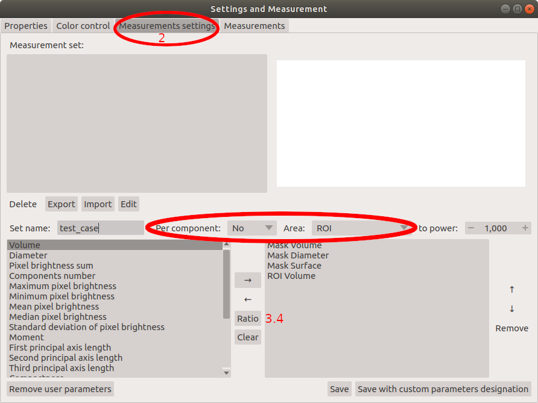
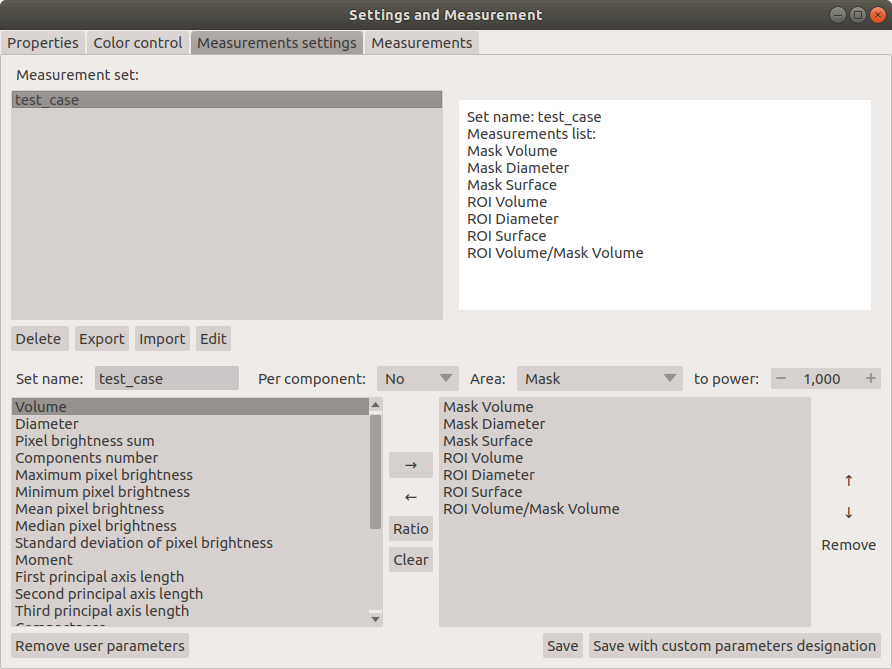

# Chromosome 1 territory analysis

### Use case
This tutorial shows how to segment nuclei from 3D confocal images and later how to analyse several parameters of chromosomal territories of chromosome 1 using PartSeg.

Rat postmitotic neurons were fixed and subjected to fluorescent in situ hybridization (FISH)
with chromosome paint probes specific to chromosome 1. Nuclei were counterstained with Hoechest, which binds specifically to DNA. Next 3D images were acquired in 16-bit using confocal microscope.

Dataset for this tutorial can be downloaded from [here](http://4dnucleome.cent.uw.edu.pl/PartSeg/Downloads/PartSeg_samples.zip).
It contains original 3D confocal image (stack1.lsm), segmentation of aforementioned image (stack1.seg), and folder containing tiffs of single nuclei and mask files (stack1_components).
Data contains 2 channels: channel 1 represents DNA staining and channel 2- chromosome paint probe. Voxel size of the whole data set is 77.52x77.52x210 nm.
Information from channel 1 is used for the segmentation of nuclei and masks generation.
Based on created masks, nuclear volume, diameter and surface are calculated in later analysis.
In order to segment chromosomal territories threshold on channel 1 is adjusted to cover whole chromosome paint staining.
Later several parameters of segmented components like: volume, number and surface etc. are calculated.

## Analysis steps

#### Segmentation of nuclear volume and creation of masks

Firstly segmentation of nuclei is performed based on the DNA signal. Segmented nuclei are cut from the original picture and mask files with segmentation parameters are created.

1.  Open PartSeg

2.  Select "Mask Segmentation"  
    

3.  Load image  
    

4.  Ensure that threshold segmentation method is selected

5.  Set threshold parameters to:
    1.  Channel: 1
    2.  Threshold: Manual
    3.  Threshold: 8000 (of channel brightness value)
    4.  Minimum size: 100000 pixels
    5.  Enable: Fill holes
    6.  Maximum holes size: 800 pixels
    7.  Enable: Smooth borders
    8.  Smooth borders radius: 1 pixel
    9.  Filter: Gauss
    10. Gauss type: Layer
    11. Gauss radius: 1
    12. Enable: Use convex hull

    This option allows to calculate convex hull for each of segmented components. It enables to include in segmentation structures with low signal intensity like nucleoli, located close to the nuclear border.

6.  Execute segmentation

7.  Select nuclei that were segmented correctly (where mask includes whole volume of a single nucleus) by selecting one by one on the picture.
    If all nuclei are segmented properly use **Select all** option. The borders of segmentation are visible after enabling "show results" option (7a).
    After the first iteration the rest of nuclei can be subjected to another round of segmentation with a higher threshold.

8.  Each of segmented and selected nuclei and it's mask can be saved as separate 3D tiff image using **Save components** option.
    Images containing all channels of the original picture are saved under the initial name with a "component" and number suffix.
    Mask files are saved with the same name with extended suffix:_mask.
    (`stack1_component5.tif`, `stack1_component6.tif`, `stack1_component7.tif`, ...)
    (`stack1_component5_mask.tif`, `stack1_component6_mask.tif`, `stack1_component7_mask.tif`, ...)

9.  The whole segmentation can be saved separately (**Save segmentation** option) and later can be loaded using **Load segmentation** menu.  
    

#### Segmentation of chromosome 1 territories

In order to qauntify features of chromosome 1 territory segmentation of FISH specyfic signal is carried off. Threshold for segmentation is adjusted to cover whole chromosome paint staining.

1.  Open PartSeg

2.  Select **Segmentation Analysis**  
    

3.  Load data:
    1.  Select **Open** button or press **ctrl+O** (cmd+O on mac)

    2.  Select **image with mask**  
        

    3.  Select image to load: `stack1_component5.tif`

    4.  Select matching mask file in the next step: `stack1_component5_mask.tif`

    You can also simply drag and drop both files on the main window.

4.  Enable **Synchronise view** option  
    

5.  Disable channel 1 (DNA staining) on both windows

6.  Enable **Mask** option on the left panel

7.  Set algorithm parameters to:
    1.  Use Lower Threshold Flow

    2.  Threshold type: Base/Core

    3.  Core Threshold: Manual, threshold value: 19500

    4.  Base Threshold: Manual, threshold value: 11500

    5.  Flow type: MultiScale Opening Sprawl

    6.  Channel: 2

    7.  Minimum size (px): 800

    8.  Filter: Gauss with type Layer and radius 1

    9.  Connect only sides: Not checked  
        This option limits segmentation to pixels connected side by side.

    Chromosomal territories are irregular structures and disabling this
    option reduce a risk of losing small bumps and protrusions.

8.  Execute segmentation

Some background signal is always present in FISH, however specific signal is much brighter.
As an example nucleus with two separate chromosome 1 territories is shown,
nevertheless chromosomes can reside in close proximity. 3D-Multiscale opening algorithm enables separation of conjoined structures.

#### Measurements settings

In this example we show how to measure volume, diameter and surface of a whole nucleus
(calculated based on created mask) and volume, diameter and surface of chromosome 1 territories
(these parameters are calculated based on a set threshold).
In addition we calculated ratio of chromosome 1 to nucleus volume to show how big is chromosome 1 in relation to the whole nucleus.

1.  Open **Settings and Measurement** option  
    

2.  Select *Measurements settings**  
    

3.  Prepare profile of parameters for chromosome 1 territories analysis.

    1.  First introduce name "test_case" for created profile.

    2.  Next select parameters calculated for the whole nucleus, which are based on mask: Therefore select **Mask** for option **Area** and **No**, for option **Components**.
        From the list of parameters in the left panel select: Volume, Diameter and Surface. Confirm each parameter by adding
        it to created profile shown in the right panel (use button with symbol **→** to confirm).

    3.  Next select parameters calculated for chromosome 1 territory:
        Select **Segmentation** for option **Area** and **No**, for option **Components** and again from the list
        of parameters on the left select: Volume, Diameter and Surface.

    4.  At the end, create ratio of volume of chromosome 1 to the whole nucleus volume.
        Select **Volume** parameter for **Segmentation** like in 3.3, next confirm with button **Ratio** (see 3.4 at the attached image),
        than select **Volume** parameter for **Mask** like in 3.2 and again confirm with button **Ratio**. Ratio is now added to the profile.
        Note that newly created parameter can be included to the main list and use in future analysis.
        Select new parameter from created profile and transfer it to the list on the left side by using button with symbol **←**.

    5.  At the end save your profile with a specific name ("test_case" in our example).
        The parameter profiles can be exported to `.json` file as a backup and future import.

#### Measurements
At the end established settings profile is used to measure features of nuclei and chromosome 1 territory and table with results is created.

1.  In **Settings and Measurement** menu check for **Properties**. The pixel size and an voxel depth should be the same as the original image.
    The rest of measurements depends on these properties, so make sure they are correct.

2.  Next select **Measurements** to get a preview on actual numbers.  
      
    Select channel 1 and profile "test_case" created in the last paragraph. Enable **Horizontal view** and select units of choice. Execute the analysis with **Calculate and append results** button.
    Resulting table can be copied to any text, or spreadsheet file using **copy to clipboard** option.

3.  Next, open file `stack1_component1.tif` and load mask file `stack1_component1_mask.tif` from `stack1_components` folder.
    Without changing any parameters select **Execute** in main window and **Calculate and append results** once more.
    Second line of results shows the same set of measurements for the second nucleus. Measurements are shown in selected units.  
    

## Appendix

### Chromosome 1 dataset
Data set contains 5 original 3D confocal images of chromosome 1 FISH. Data contains 2 channels: channel 1 represents DNA staining and channel 2- chromosome paint probe. Voxel size of the whole data set is 77.52x77.52x210 nm.
[download link](http://4dnucleome.cent.uw.edu.pl/PartSeg/Downloads/chromosome_1_stacks.zip) (713MB).

### Chromosome 16 dataset
Data set contains 5 original 3D confocal images of chromosome 1 FISH. Data contains 2 channels: channel 2 represents DNA staining and channel 1- chromosome paint probe. Voxel size of the whole data set is 77.52x77.52x210 nm.
[download link](http://4dnucleome.cent.uw.edu.pl/PartSeg/Downloads/chromosome_16_stacks.zip) (1.3GB).

### FAQ
1.  _Cannot enable **Mask**_
    Check if you load mask. You can add it with **mask to image** file type in open dialog

2.  _Enable **Mask** do not change anything_
    In **Settings and Measurements** in tab **Properties** check **Mask mark color** and **Mask mark opacity**. Mask marking can blend in background.

[comment]: <> (pandoc -t html -s -o tutorial-chromosome1.html --css pandoc.css -M pagetitle:"Chromosome 1 territory analysis"  tutorial-chromosome1.md)
